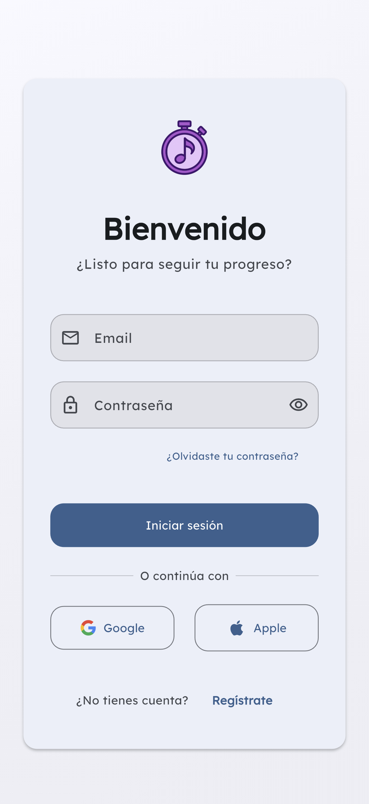
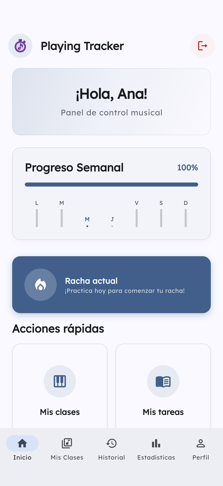
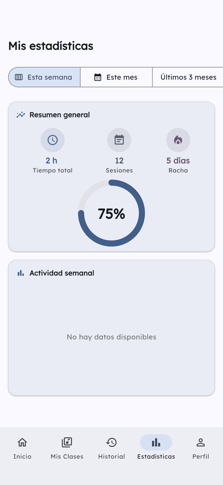
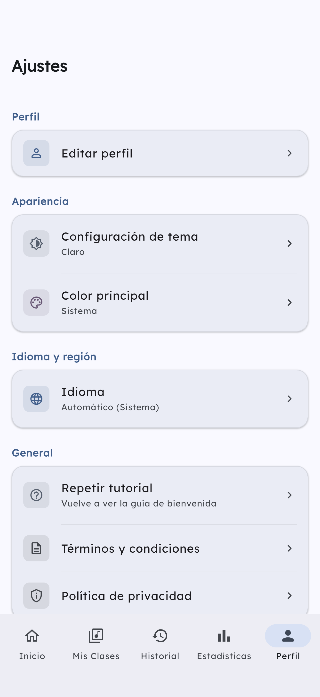

<div align="center">

# Playing Tracker

**Seguimiento inteligente del estudio musical**

[](https://flutter.dev)
[](https://dart.dev)
[](https://firebase.google.com)
[](#licencia)

</div>

---

Playing Tracker es una aplicación móvil multiplataforma (iOS y Android) desarrollada con Flutter y Firebase. Digitaliza y objetiva el seguimiento del estudio instrumental fuera del aula: los docentes asignan tareas específicas y los alumnos registran el tiempo dedicado a cada una de forma precisa.

---

## Capturas de pantalla

<div align="center">

| Inicio de sesión | Panel principal | Estadísticas | Ajustes |
|:---:|:---:|:---:|:---:|
|  |  |  |  |

</div>

---

## Características

### Módulo Alumno

- **Clases:** unirse mediante código de acceso único generado por el docente.
- **Tareas:** visualización de tareas pendientes y sus objetivos de práctica.
- **Cronómetro inteligente:** registro en tiempo real con auto-pausa al salir de la app y reanudación manual.
- **Historial:** registro detallado de sesiones con fechas, duraciones y notas.
- **Estadísticas:** resumen semanal, mensual y trimestral con gráficos de actividad y rachas.

### Módulo Docente

- **Clases:** crear, editar y archivar clases grupales.
- **Alumnos:** administración de miembros, códigos de invitación y monitoreo de actividad.
- **Tareas:** asignación con título, descripción y tiempo sugerido de práctica.

### Seguridad y diseño

- Autenticación con Email/Contraseña, Google y Apple mediante Firebase Auth.
- Roles diferenciados con interfaces y permisos separados para docente y alumno.
- Material Design 3 con soporte completo para tema claro y oscuro.
- Arquitectura feature-first con código testeado y escalable.

---

## Stack tecnológico

| Capa | Tecnología |
|---|---|
| UI / Frontend | Flutter 3.x · Dart 3.x · Material Design 3 |
| Backend | Firebase Auth · Cloud Firestore · Firebase App Check |
| Estado | flutter\_bloc (Cubit) · HydratedBloc |
| Navegación | go\_router con guardas reactivas por rol |
| Gráficos | fl\_chart |
| Testing | flutter\_test · mocktail · fake\_cloud\_firestore |

---

## Instalación

> **Requisito previo:** los archivos de configuración de Firebase (`google-services.json` / `GoogleService-Info.plist`) no están incluidos en el repositorio. Contacta al mantenedor para obtenerlos.

```bash
# 1. Clonar el repositorio
git clone <repository-url>
cd playing_tracker

# 2. Instalar dependencias
flutter pub get

# 3. Generar código (modelos JSON / freezed)
dart run build_runner build --delete-conflicting-outputs

# 4. Ejecutar tests
flutter test

# 5. Lanzar la app
flutter run
```

---

## Arquitectura

El proyecto sigue **Clean Architecture** organizada por features:

```
lib/
├── config/
│   ├── routes/          # GoRouter con guardas reactivas por rol
│   └── theme/           # Material Design 3 (ColorScheme.fromSeed, claro/oscuro)
├── core/                # Constantes, extensiones, validadores, error mapper
├── features/
│   ├── auth/            # Login y registro
│   ├── classes/         # Clases y membresías
│   ├── tasks/           # Gestión de tareas
│   ├── sessions/        # Cronómetro e historial
│   ├── statistics/      # Estadísticas y dashboards
│   └── settings/        # Ajustes de la app
├── shared/widgets/      # Componentes UI reutilizables
└── l10n/                # Localización (Español · English)
```

Cada feature se estructura en tres capas:

```
feature/
├── data/repositories/   # Implementaciones Firebase
├── domain/              # Modelos, interfaces, enums
└── presentation/
    ├── cubit/           # Estado (Cubit)
    ├── screens/
    └── widgets/
```

---

## Licencia

Proyecto privado para fines educativos. Todos los derechos reservados.
