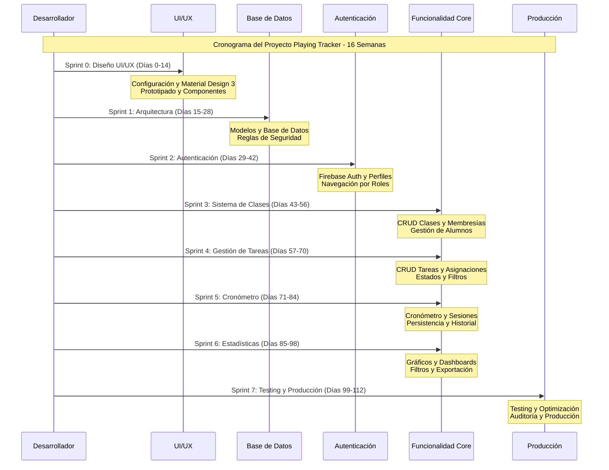

# 📋 Análisis de Requisitos y Fase de Diseño - Playing Tracker

**Proyecto:** Playing Tracker - Sistema de Seguimiento de Estudio Musical
**Fecha:** Octubre 2025
**Versión:** 1.0

---


## 1. Documento de análisis de requisitos

### 1.1	Descripción del proyecto
Playing Tracker es una aplicación móvil multiplataforma desarrollada en Flutter que digitaliza y objetiva el seguimiento del estudio instrumental fuera del aula. Permite a los docentes asignar tareas específicas y a los alumnos registrar el tiempo dedicado a cada una de ellas, generando estadísticas de progreso.

### 1.2	Requisitos funcionales
El sistema Playing Tracker debe proporcionar un conjunto completo de funcionalidades que permitan a los docentes gestionar sus clases y tareas, mientras que los alumnos puedan registrar y seguir su progreso de estudio de manera objetiva y motivadora.
1.	Gestión de usuarios y autenticación (RF-001). El sistema usa Firebase Authentication para registrar usuarios como docentes o alumnos. Los docentes gestionan clases, mientras que los alumnos se unen con códigos únicos. Incluye recuperación de contraseñas y gestión de perfiles, garantizando seguridad y privacidad.
2.	Gestión de clases y membresías (RF-002). Los docentes crean clases con nombres descriptivos y códigos de acceso únicos de 6 caracteres alfanuméricos, generados automáticamente. Los alumnos se unen con el código, permitiendo a los docentes gestionar su grupo de estudiantes.
3.	Gestión de tareas y asignaciones (RF-003). Los docentes crean tareas detalladas con título, descripción, tiempo sugerido de estudio (minutos) y archivos adjuntos opcionales (PDFs, audio, enlaces). Pueden asignar tareas a clases o alumnos específicos. El sistema crea automáticamente asignaciones individuales para clases completas.
4.	Cronómetro y registro de sesiones (RF-004). Los alumnos usan un cronómetro persistente para registrar sesiones de estudio (iniciar, pausar, reiniciar, finalizar). El sistema registra automáticamente duración, pausas y notas opcionales. Funciona en segundo plano, incluso al cambiar de app o recibir llamadas.
5.	Estadísticas y reportes (RF-005). El sistema genera estadísticas y visualizaciones del progreso de estudio para docentes y alumnos. Los docentes acceden a dashboards con filtros por fecha, tarea o clase. Los alumnos ven su progreso personal con gráficos.

### 1.3	Requisitos no funcionales
Los requisitos no funcionales establecen las características de calidad, rendimiento y restricciones técnicas que el sistema debe cumplir para garantizar una experiencia de usuario óptima y un funcionamiento seguro en entornos educativos reales.
1.	Rendimiento y eficiencia (RNF-001). El sistema garantiza tiempos de respuesta inferiores a 2 segundos para todas las operaciones CRUD, soportando 1000 usuarios concurrentes sin degradación. Implementa índices compuestos en Firestore, cache inteligente y paginación para listas extensas. El cronómetro mantiene precisión de milisegundos y actualiza la interfaz cada segundo sin afectar el rendimiento.
2.	Seguridad y privacidad (RNF-002). Dado que maneja datos de menores, la seguridad es crítica. Todas las operaciones requieren autenticación con reglas de seguridad granulares. Los datos se cifran en tránsito (HTTPS/TLS) y en reposo (Firestore). Cumple con RGPD y LOPDGDD, incluyendo consentimiento explícito, derecho al olvido y portabilidad de datos. Contraseñas almacenadas con hash seguro y autenticación de dos factores opcional.
3.	Usabilidad y accesibilidad (RNF-003). La interfaz de usuario, basada en Material Design 3, ofrece una experiencia moderna e intuitiva para usuarios jóvenes y adultos. Soporta temas claro y oscuro con transiciones suaves. La accesibilidad es prioritaria: contraste mínimo de 4.5:1 para textos normales y 3:1 para grandes, soporte para TalkBack (Android) y VoiceOver (iOS), y áreas de toque de 48x48 dp. La navegación es fluida con animaciones de 300ms y feedback táctil.
4.	Escalabilidad y mantenibilidad (RNF-004). La arquitectura NoSQL evita hotspots con distribución inteligente de datos y claves compuestas. Un mecanismo de fan-out eficiente asigna tareas a clases de hasta 100 alumnos sin degradación del rendimiento. La escalabilidad horizontal en Firebase permite el crecimiento orgánico, y la arquitectura modular facilita el mantenimiento y la adición de funcionalidades sin afectar el código existente.

### 1.4	Planificación del proyecto
El proyecto Playing Tracker se desarrollará con Scrum adaptado y “diseño primero”, priorizando la experiencia de usuario. Tendrá 8 sprints de 2 semanas, 16 semanas en total, con un desarrollador full-stack especializado en Flutter y Firebase.

#### 1.4.1	Metodología y enfoque
La metodología combina Scrum con un enfoque centrado en el diseño. Las dos primeras semanas se dedican a crear prototipos de alta fidelidad e implementar Material Design 3. Así, se toman todas las decisiones de UX/UI antes de la implementación de la lógica de negocio, reduciendo el rework y mejorando la calidad.

#### 1.4.2	Cronograma detallado
El Sprint 0 configurará el proyecto, implementará Material Design 3, prototipará todas las pantallas y desarrollará componentes base reutilizables. El Sprint 1 abordará la arquitectura de datos con 7 colecciones de Firestore, modelos de dominio, reglas de seguridad e índices optimizados. Los Sprints 2-4 cubrirán la funcionalidad core: autenticación, sistema de clases y membresías, y gestión de tareas. Los Sprints 5-6 implementarán funcionalidades avanzadas: cronómetro persistente y sistema de estadísticas. El Sprint 7 se dedicará a testing, optimización de rendimiento, auditoría de seguridad y preparación para producción.

#### 1.4.3	Estimación de costes
El coste total del proyecto se estima en 32,000€, calculado sobre la base de 16 semanas de desarrollo a 40 horas semanales con una tarifa de 50€/hora para un desarrollador senior especializado en Flutter. Esta estimación incluye el desarrollo completo de la aplicación, pero excluye costes de infraestructura (Firebase ofrece un tier gratuito generoso) y herramientas de desarrollo (Flutter, Android Studio, VS Code son gratuitas). El presupuesto es competitivo para una aplicación de esta complejidad y alcance, especialmente considerando la calidad y escalabilidad de la solución propuesta.

#### 1.4.4	Metodología de seguimiento
Los sprints tienen entregables específicos y medibles, revisados semanalmente para asegurar el cumplimiento de objetivos. El diagrama de la Ilustración 1 muestra las dependencias entre tareas para una gestión eficiente de recursos y detección temprana de retrasos. Las actividades permiten testing continuo y feedback iterativo para garantizar la calidad del producto.

### 1.5 Cronograma de Desarrollo (Diagrama de Gantt)

El siguiente diagrama de Gantt muestra la planificación detallada del proyecto Playing Tracker, organizando las actividades por sprints con sus respectivos entregables y dependencias:

Ilustración 1. Diagrama de Gantt - Cronograma de desarrollo

La imagen se encuentra guardada en /docs/images/Diagrama Gantt.png



---

## 2	Necesidades hardware, software y de personal necesarias para la aplicación. Presupuesto

### 2.1	Infraestructura hardware
•	Equipamiento de desarrollo: se utilizará un MacBook Pro M2 con 16 GB de RAM y 512 GB de SSD para el desarrollo de Flutter.
•	Dispositivos de prueba: se utilizarán un iPhone 15 Pro (para iOS) y un Realme 6s (para Android) para pruebas multiplataforma.

### 2.2	Software necesario
#### 2.2.1	Software de desarrollo gratuito
Playing Tracker usa herramientas de código abierto y gratuitas. Flutter SDK 3.x es el framework principal para desarrollo multiplataforma nativo. Android Studio es el IDE principal para Android, y VS Code con extensiones Flutter ofrece un entorno ligero y personalizable. Firebase CLI gestiona los servicios de Firebase, Git el control de versiones, y Dart SDK es el lenguaje de programación. Esta selección minimiza costes de licencias y ofrece herramientas de clase empresarial.

#### 2.2.2	Software de pago opcional
Para un diseño y desarrollo eficientes, puede utilizarse Figma Pro (20€/mes) para prototipos de alta fidelidad y colaboración. Firebase Blaze Plan, con un modelo pay-as-you-go, es ideal para producción y se adapta al crecimiento del usuario. Estos costes son opcionales en desarrollo, pero recomendados para un producto profesional.

### 2.3	Personal necesario
#### 2.3.1	Perfil del desarrollador
Se cuenta con un desarrollador full-stack junior con experiencia en Flutter, desarrollo móvil e integración con Firebase. Responsable del desarrollo completo de la app, incluyendo UI/UX (Material Design 3), integración Firebase (Auth, Firestore, Storage) y testing en múltiples dispositivos. Tiene conocimientos en arquitectura móvil, gestión de estado con Cubit y optimización de rendimiento.

### 2.4	Recursos de interconexión y hosting
#### 2.4.1	Infraestructura en la nube
Firebase ofrece la infraestructura backend completa para Playing Tracker, con servicios gratuitos generosos para las necesidades iniciales. Firebase Authentication es gratuito, Firestore ofrece 1GB gratis, Firebase Storage incluye 1GB gratis y Firebase Hosting es gratuito. Esta arquitectura serverless elimina la gestión de servidores y escala automáticamente.

#### 2.4.2	Estimación de costes operativos
Los costes anuales de infraestructura oscilan entre 0 y 100€, según el crecimiento de usuarios, más 15€ por el dominio de la aplicación. Firebase, con su modelo de pago por uso, se adapta al crecimiento orgánico del proyecto, permitiendo empezar con costes mínimos y escalar según la demanda.

### 2.5	Alternativas técnicas consideradas
#### 2.5.1	Análisis de alternativas
En la fase de planificación, se han evaluado varias alternativas tecnológicas. React Native + Node.js tenía un ecosistema maduro, pero menor rendimiento y mayor complejidad. Flutter + Supabase era una solución open source atractiva, pero menos madura y con mayor configuración inicial. Flutter + AWS ofrecía máxima escalabilidad, pero mayor complejidad y costes operativos.

#### 2.5.2	Justificación de la elección
La combinación Flutter + Firebase se ha seleccionado por ofrecer el mejor balance entre velocidad de desarrollo, coste controlado, y escalabilidad para un MVP. Material Design 3 garantiza consistencia visual y accesibilidad nativa, mientras que la arquitectura NoSQL de Firestore proporciona la flexibilidad necesaria para evolucionar el esquema de datos según las necesidades del proyecto. Esta elección minimiza los riesgos técnicos y acelera el time-to-market.

### 2.6	Presupuesto detallado y financiación
#### 2.6.1	Desglose de costes
El presupuesto total del proyecto asciende a 36,340€, distribuido en hardware (4,000€ si no se posee), software (340€/año), y personal (32,000€). El coste de desarrollo representa el 88% del presupuesto, lo cual es típico para proyectos de software donde el valor principal reside en el conocimiento y la experiencia del desarrollador. Los costes de hardware y software son una inversión única o recurrente mínima comparada con el valor generado.

#### 2.6.2	Estrategia de financiación
El proyecto se autofinanciará inicialmente para mantener el control sobre el desarrollo y la propiedad intelectual. Para marketing y expansión se usará crowdfunding dirigido a la comunidad educativa musical y se buscarán subvenciones de programas de innovación educativa que valoren su potencial pedagógico. Esta estrategia diversificada minimiza riesgos y permite un crecimiento sostenible.

---

## 3	Diseño del diagrama de casos de uso

### 3.1	Actores del sistema
El sistema Playing Tracker interactúa con tres tipos de actores principales que representan los diferentes roles y entidades involucradas en el proceso educativo musical:
•	Docente. Representa al profesor de música que utiliza la aplicación para gestionar sus clases, crear tareas, asignar actividades a sus alumnos, y supervisar el progreso de estudio. El docente tiene permisos administrativos completos sobre las clases que crea y puede acceder a estadísticas detalladas de todos sus alumnos. Este actor es responsable de la configuración inicial del entorno educativo y la definición de los objetivos de aprendizaje.
•	Alumno. Representa al estudiante de música que utiliza la aplicación para acceder a sus tareas asignadas, registrar sesiones de estudio mediante el cronómetro, y consultar su progreso personal. El alumno tiene permisos limitados a sus propios datos y tareas asignadas, garantizando la privacidad y seguridad de la información. Este actor es el usuario final que se beneficia directamente de las funcionalidades de seguimiento y motivación.
•	Sistema. Representa la aplicación Playing Tracker y sus componentes internos que procesan automáticamente los datos, generan estadísticas, envían notificaciones, y mantienen la sincronización entre dispositivos. El sistema actúa como intermediario entre docentes y alumnos, facilitando la comunicación y el seguimiento del progreso educativo.

### 3.2	Diagrama de casos de uso

Ilustración 2. Diagrama de casos de uso

La imagen se encuentra guardada en /docs/images/Diagrama Casos de uso.png

```mermaid
flowchart LR
flowchart LR
    subgraph "Actores"
        D[👨‍🏫 Docente]
        A[👨‍🎓 Alumno]
    end

    subgraph "Sistema Playing Tracker"
        UC1[Autenticación]
        UC2[Crear clase]
        UC3[Ver clase]
        UC4[Crear tarea]
        UC5[Ver tareas]
        UC6[Estadísticas]
        UC7[Unirse a clase]
        UC8[Iniciar sesión]
        UC9[Finalizar sesión]
        UC10[Progreso]
    end

    %% Flujo Docente
    D --> UC1
    UC1 --> UC2
    UC2 --> UC3
    UC3 --> UC4
    UC4 --> UC5
    UC5 --> UC6

    %% Flujo Alumno
    A --> UC1
    UC1 --> UC7
    UC7 --> UC5
    UC5 --> UC8
    UC8 --> UC9
    UC9 --> UC10

    %% Estilos
    classDef actor fill:#e3f2fd,stroke:#1976d2,stroke-width:3px
    classDef docente fill:#fff3e0,stroke:#f57c00,stroke-width:2px
    classDef alumno fill:#e8f5e8,stroke:#388e3c,stroke-width:2px
    classDef comun fill:#f3e5f5,stroke:#7b1fa2,stroke-width:2px

    class D,A actor
    class UC2,UC3,UC4,UC5,UC6 docente
    class UC7,UC8,UC9,UC10 alumno
    class UC1 comun
```

### 3.3	Casos de uso principales

#### 3.3.1	UC-001. Autenticación de usuario

| Campo | Descripción |
|-------|-------------|
| **Descripción breve** | El usuario se autentica en el sistema Playing Tracker utilizando sus credenciales de email y contraseña, siendo redirigido automáticamente a la interfaz correspondiente según su rol (docente o alumno). |
| **Precondiciones** | El usuario debe estar registrado previamente en el sistema con un email válido y contraseña. La aplicación debe estar instalada y funcionando correctamente en el dispositivo del usuario. |
| **Pasos habituales** | 1. El usuario abre la aplicación Playing Tracker. 2. El sistema presenta la pantalla de login con campos para email y contraseña. 3. El usuario introduce sus credenciales y presiona el botón "Iniciar Sesión". 4. El sistema valida las credenciales contra Firebase Authentication. 5. Si las credenciales son correctas, el sistema consulta el rol del usuario en Firestore. 6. El sistema redirige al usuario a la pantalla home correspondiente (docente o alumno). 7. El sistema establece la sesión activa y carga los datos del usuario. |
| **Postcondiciones** | El usuario está autenticado en el sistema con su sesión activa. Se ha cargado su perfil completo con nombre, apellidos, email y rol. El usuario puede acceder a todas las funcionalidades permitidas según su rol. |
| **Excepciones** | Si las credenciales son incorrectas, el sistema muestra un mensaje de error específico. Si el usuario no existe, se ofrece la opción de registro. Si hay problemas de conectividad, se muestra un mensaje de error de red. Si el usuario está desactivado, se informa del estado de la cuenta. |

#### 3.3.2	UC-002. Crear clase (docente)

| Campo | Descripción |
|-------|-------------|
| **Descripción breve** | El docente crea una nueva clase virtual en el sistema, definiendo su nombre, descripción opcional, y obteniendo automáticamente un código de acceso único que podrá compartir con sus alumnos para que se unan a la clase. |
| **Precondiciones** | El docente debe estar autenticado en el sistema con rol de docente. Debe tener conexión a internet activa. No debe existir una clase con el mismo nombre creada por el mismo docente. |
| **Pasos habituales** | 1. El docente accede a la pantalla "Mis Clases" desde el menú principal. 2. Presiona el botón "Crear Nueva Clase". 3. El sistema presenta un formulario con campos para nombre de clase y descripción opcional. 4. El docente introduce el nombre de la clase (mínimo 3 caracteres) y una descripción opcional. 5. Presiona el botón "Crear Clase". 6. El sistema valida los datos introducidos. 7. El sistema genera automáticamente un código de acceso único de 6 caracteres alfanuméricos. 8. El sistema crea el documento de clase en Firestore con todos los datos. 9. El sistema muestra la nueva clase creada con su código de acceso. |
| **Postcondiciones** | Se ha creado una nueva clase en el sistema con un identificador único. La clase tiene un código de acceso único generado automáticamente. El docente puede ver la clase en su lista de clases. La clase está activa y lista para que los alumnos se unan. |
| **Excepciones** | Si el nombre de la clase ya existe para el mismo docente, se muestra un mensaje de error pidiendo un nombre diferente. Si hay problemas de conectividad, se informa del error y se sugiere reintentar. Si el formulario está incompleto, se resaltan los campos obligatorios. Si hay un error interno del sistema, se muestra un mensaje genérico de error. |

#### 3.3.3	UC-003. Unirse a clase (alumno)

| Campo | Descripción |
|-------|-------------|
| **Descripción breve** | El alumno se une a una clase existente introduciendo el código de acceso proporcionado por su docente, estableciendo así una relación de membresía que le permitirá acceder a las tareas y actividades de esa clase. |
| **Precondiciones** | El alumno debe estar autenticado en el sistema con rol de alumno. Debe tener un código de acceso válido proporcionado por un docente. La clase debe existir y estar activa en el sistema. El alumno no debe estar ya unido a esa clase. |
| **Pasos habituales** | 1. El alumno accede a la pantalla "Unirse a Clase" desde el menú principal. 2. El sistema presenta un campo de texto para introducir el código de acceso. 3. El alumno introduce el código de 6 caracteres proporcionado por su docente. 4. Presiona el botón "Unirse a Clase". 5. El sistema valida el formato del código (6 caracteres alfanuméricos). 6. El sistema busca la clase correspondiente al código en Firestore. 7. Si la clase existe y está activa, el sistema crea un documento de membresía. 8. El sistema actualiza la lista de clases del alumno. 9. El sistema muestra un mensaje de confirmación de unión exitosa. |
| **Postcondiciones** | El alumno se ha unido exitosamente a la clase. Se ha creado una relación de membresía en el sistema. El alumno puede ver la clase en su lista de clases. El alumno puede acceder a las tareas asignadas a esa clase. El docente puede ver al alumno en la lista de miembros de la clase. |
| **Excepciones** | Si el código introducido no existe, se muestra un mensaje de error indicando que el código es inválido. Si la clase está desactivada, se informa que la clase no está disponible. Si el alumno ya está unido a la clase, se muestra un mensaje informativo. Si hay problemas de conectividad, se sugiere verificar la conexión e intentar nuevamente. |

#### 3.3.4	UC-004. Crear tarea (docente)

| Campo | Descripción |
|-------|-------------|
| **Descripción breve** | El docente crea una nueva tarea de estudio definiendo todos sus detalles (título, descripción, tiempo sugerido, archivos adjuntos) y la asigna a una clase completa o a alumnos específicos, generando automáticamente las asignaciones individuales correspondientes. |
| **Precondiciones** | El docente debe estar autenticado con rol de docente. Debe tener al menos una clase creada o alumnos disponibles para asignar. Debe tener conexión a internet activa. Los datos de la tarea deben cumplir con las validaciones establecidas. |
| **Pasos habituales** | 1. El docente accede a la pantalla "Crear Tarea" desde el menú de gestión de tareas. 2. El sistema presenta un formulario completo con todos los campos necesarios. 3. El docente introduce el título de la tarea (mínimo 5 caracteres). 4. El docente escribe una descripción detallada de la tarea (mínimo 10 caracteres). 5. El docente especifica el tiempo sugerido de estudio en minutos (mínimo 5, máximo 480). 6. Opcionalmente, el docente adjunta archivos (PDF, audio) o enlaces externos. 7. El docente selecciona los destinatarios: clase completa o alumnos específicos. 8. Opcionalmente, el docente establece una fecha límite para la tarea. 9. El docente presiona el botón "Crear y Asignar Tarea". 10. El sistema valida todos los datos introducidos. 11. El sistema crea el documento de tarea en Firestore. 12. El sistema ejecuta el fan-out para crear las asignaciones individuales. 13. El sistema muestra confirmación de creación exitosa. |
| **Postcondiciones** | Se ha creado una nueva tarea en el sistema con identificador único. La tarea ha sido asignada a todos los destinatarios seleccionados. Cada alumno destinatario tiene una asignación individual creada. Los alumnos pueden ver la nueva tarea en su lista de tareas pendientes. El docente puede gestionar la tarea desde su panel de control. |
| **Excepciones** | Si algún campo obligatorio está vacío, se resaltan los campos faltantes. Si el tiempo sugerido está fuera del rango permitido, se muestra un mensaje de error específico. Si hay problemas durante el fan-out, se informa del error y se sugiere reintentar. Si los archivos adjuntos exceden el tamaño permitido, se informa del límite. Si no hay destinatarios disponibles, se sugiere crear una clase o agregar alumnos. |

#### 3.3.5	UC-005. Iniciar sesión de estudio (alumno)

| Campo | Descripción |
|-------|-------------|
| **Descripción breve** | El alumno inicia una sesión de estudio cronometrada para una tarea específica, activando el cronómetro persistente que registrará automáticamente el tiempo dedicado al estudio, incluso si la aplicación pasa a segundo plano. |
| **Precondiciones** | El alumno debe estar autenticado con rol de alumno. Debe tener al menos una tarea asignada con estado "pending" o "in_progress". No debe tener una sesión activa en curso. Debe tener conexión a internet para el registro inicial. |
| **Pasos habituales** | 1. El alumno accede a su lista de tareas desde el menú principal. 2. El alumno selecciona una tarea específica de la lista. 3. El sistema muestra los detalles de la tarea y el botón "Iniciar Estudio". 4. El alumno presiona el botón "Iniciar Estudio". 5. El sistema presenta la pantalla de cronómetro con controles de estudio. 6. El sistema registra el inicio de la sesión con timestamp preciso. 7. El sistema inicia el cronómetro y lo mantiene activo. 8. El sistema actualiza el estado de la asignación a "in_progress". 9. El alumno puede pausar, reanudar o finalizar la sesión en cualquier momento. |
| **Postcondiciones** | Se ha iniciado una sesión de estudio activa para la tarea seleccionada. El cronómetro está funcionando y registrando el tiempo transcurrido. El estado de la asignación se ha actualizado a "in_progress". El sistema está preparado para persistir la sesión en segundo plano. El alumno puede ver el tiempo transcurrido en tiempo real. |
| **Excepciones** | Si la tarea no está disponible, se muestra un mensaje explicativo. Si ya hay una sesión activa, se informa y se ofrece la opción de finalizarla primero. Si hay problemas de conectividad, se inicia la sesión en modo offline. Si la tarea ha expirado, se informa del estado y se sugiere contactar al docente. |

#### 3.3.6	UC-006. Finalizar sesión de estudio (alumno)

| Campo | Descripción |
|-------|-------------|
| **Descripción breve** | El alumno finaliza su sesión de estudio cronometrada, confirmando la finalización y permitiendo al sistema calcular la duración total, actualizar las estadísticas, y registrar la sesión completada en la base de datos. |
| **Precondiciones** | Debe existir una sesión de estudio activa iniciada previamente. El cronómetro debe estar funcionando y haber registrado al menos 1 minuto de tiempo. El alumno debe estar autenticado y tener conexión a internet para sincronizar los datos. |
| **Pasos habituales** | 1. El alumno está en la pantalla de cronómetro con una sesión activa. 2. El alumno presiona el botón "Finalizar Sesión". 3. El sistema presenta una pantalla de confirmación mostrando el tiempo total registrado. 4. El alumno puede agregar notas opcionales sobre la sesión de estudio. 5. El alumno confirma la finalización presionando "Confirmar". 6. El sistema calcula la duración total de la sesión (tiempo activo menos pausas). 7. El sistema crea el documento de sesión en Firestore con todos los datos. 8. El sistema actualiza las estadísticas del alumno (sesiones totales, tiempo total). 9. El sistema actualiza el progreso de la asignación correspondiente. 10. El sistema muestra un mensaje de confirmación y regresa a la lista de tareas. |
| **Postcondiciones** | La sesión de estudio ha sido registrada exitosamente en la base de datos. Las estadísticas del alumno se han actualizado con la nueva sesión. El progreso de la tarea se ha actualizado con el tiempo adicional registrado. El cronómetro se ha detenido y la sesión ya no está activa. El alumno puede ver la sesión en su historial personal. |
| **Excepciones** | Si el tiempo registrado es menor a 1 minuto, se sugiere continuar estudiando. Si hay problemas de conectividad, se guarda localmente y se sincroniza cuando se recupere la conexión. Si hay errores al guardar, se informa del problema y se sugiere reintentar. Si la sesión ya fue finalizada, se muestra un mensaje informativo. |

#### 3.3.7	UC-007. Consultar estadísticas de progreso (docente/alumno)

| Campo | Descripción |
|-------|-------------|
| **Descripción breve** | El usuario (docente o alumno) consulta estadísticas detalladas de progreso de estudio, aplicando filtros específicos según sus necesidades, y visualizando gráficos y métricas que le permiten evaluar el rendimiento y evolución del aprendizaje musical. |
| **Precondiciones** | El usuario debe estar autenticado en el sistema. Debe existir al menos una sesión de estudio registrada para generar estadísticas. Para docentes, debe tener al menos una clase con alumnos activos. Para alumnos, debe tener al menos una tarea asignada y una sesión completada. |
| **Pasos habituales** | 1. El usuario accede a la sección "Estadísticas" desde el menú principal. 2. El sistema presenta la pantalla de estadísticas con filtros disponibles. 3. El usuario selecciona el período de tiempo (última semana, mes, trimestre, año). 4. Para docentes: selecciona la clase específica o "todas las clases". 5. Para alumnos: selecciona la tarea específica o "todas las tareas". 6. El usuario aplica filtros adicionales (días de la semana, horas del día). 7. El sistema consulta los datos correspondientes en Firestore. 8. El sistema genera gráficos y métricas en tiempo real. 9. El usuario visualiza las estadísticas con gráficos interactivos. 10. El usuario puede exportar los datos en formato CSV o PDF. |
| **Postcondiciones** | Se han mostrado las estadísticas solicitadas con los filtros aplicados. Los gráficos son interactivos y permiten exploración detallada. Los datos están actualizados y reflejan el estado actual del progreso. El usuario puede exportar la información para análisis externo. Las métricas son precisas y basadas en datos reales de sesiones registradas. |
| **Excepciones** | Si no hay datos suficientes para el período seleccionado, se muestra un mensaje informativo y se sugieren otros períodos. Si hay problemas de conectividad, se muestran los datos en caché con indicador de actualización pendiente. Si los filtros no devuelven resultados, se sugiere ampliar el rango de búsqueda. Si hay errores en la generación de gráficos, se muestran los datos en formato tabular. |

---

## 4. 🎨 Diseño de la Interfaz de la Aplicación

### 4.1 Flujo de Navegación Principal

```
Splash Screen
    ↓
Login/Register
    ↓
Home (según rol)
    ├── Docente: Dashboard → Clases → Tareas → Estadísticas
    └── Alumno: Dashboard → Tareas → Cronómetro → Progreso
```

### 4.2 Pantallas Principales

#### Pantalla de Login
- **Elementos:** Logo, campos email/contraseña, botón login, enlace registro
- **Diseño:** Material Design 3, tema claro/oscuro
- **Validaciones:** Email válido, contraseña requerida

#### Pantalla de Registro
- **Elementos:** Formulario completo (nombre, apellidos, email, contraseña, rol)
- **Diseño:** Formulario paso a paso, validaciones en tiempo real
- **Validaciones:** Todos los campos obligatorios, email único

#### Home Docente
- **Elementos:** Cards de clases, botón crear clase, estadísticas rápidas
- **Diseño:** Grid de cards, navegación por tabs
- **Funcionalidades:** Acceso rápido a funciones principales

#### Home Alumno
- **Elementos:** Lista de tareas pendientes, cronómetro rápido, progreso
- **Diseño:** Lista vertical, cards de tareas
- **Funcionalidades:** Inicio rápido de estudio

#### Pantalla de Cronómetro
- **Elementos:** Cronómetro grande, controles (iniciar/pausar/finalizar), información de tarea
- **Diseño:** Interfaz minimalista, colores de estado
- **Funcionalidades:** Persistencia en segundo plano

### 4.3 Componentes Reutilizables

- **CustomButton:** Botones con Material Design 3
- **CustomTextField:** Campos de texto con validaciones
- **CustomCard:** Cards para mostrar información
- **LoadingOverlay:** Indicadores de carga
- **CustomAppBar:** Barra de navegación personalizada

---

## 5. 🗄️ Diseño de la Base de Datos

### 5.1 Modelo de Datos NoSQL (Firestore)

#### Tipo de Base de Datos
- **Tipo:** Document-store (Firestore)
- **Justificación:** Escalabilidad, flexibilidad, integración con Firebase

#### Entidades Principales

##### 1. Teachers (Docentes)
```json
{
  "id": "string (UID)",
  "firstName": "string (obligatorio)",
  "lastName": "string (obligatorio)",
  "email": "string (obligatorio, único)",
  "createdAt": "timestamp (obligatorio)",
  "updatedAt": "timestamp (obligatorio)",
  "isActive": "boolean (obligatorio, default: true)"
}
```

##### 2. Students (Alumnos)
```json
{
  "id": "string (UID)",
  "firstName": "string (obligatorio)",
  "lastName": "string (obligatorio)",
  "email": "string (obligatorio, único)",
  "createdAt": "timestamp (obligatorio)",
  "updatedAt": "timestamp (obligatorio)",
  "isActive": "boolean (obligatorio, default: true)",
  "totalSessionsCount": "number (obligatorio, default: 0)",
  "totalDurationLogged": "number (obligatorio, default: 0)",
  "lastSessionDate": "timestamp (opcional)"
}
```

##### 3. Classes (Clases)
```json
{
  "id": "string (obligatorio, único)",
  "name": "string (obligatorio)",
  "description": "string (opcional)",
  "ownerTeacherId": "string (obligatorio)",
  "accessCode": "string (obligatorio, único, 6 caracteres)",
  "createdAt": "timestamp (obligatorio)",
  "updatedAt": "timestamp (obligatorio)",
  "isActive": "boolean (obligatorio, default: true)"
}
```

##### 4. Memberships (Membresías)
```json
{
  "id": "string (obligatorio, único)",
  "classId": "string (obligatorio)",
  "studentId": "string (obligatorio)",
  "teacherId": "string (obligatorio)",
  "className": "string (obligatorio)",
  "joinedAt": "timestamp (obligatorio)",
  "isActive": "boolean (obligatorio, default: true)"
}
```

##### 5. Tasks (Tareas)
```json
{
  "id": "string (obligatorio, único)",
  "title": "string (obligatorio)",
  "description": "string (obligatorio)",
  "createdBy": "string (obligatorio)",
  "durationSuggested": "number (obligatorio, minutos)",
  "attachments": "array (opcional)",
  "createdAt": "timestamp (obligatorio)",
  "updatedAt": "timestamp (obligatorio)",
  "dueDate": "timestamp (opcional)",
  "isActive": "boolean (obligatorio, default: true)"
}
```

##### 6. Assignments (Asignaciones)
```json
{
  "id": "string (obligatorio, formato: taskId_studentId)",
  "taskId": "string (obligatorio)",
  "studentId": "string (obligatorio)",
  "teacherId": "string (obligatorio)",
  "status": "string (obligatorio, enum: pending|in_progress|completed)",
  "assignedAt": "timestamp (obligatorio)",
  "completedAt": "timestamp (opcional)",
  "sessionsCount": "number (obligatorio, default: 0)",
  "totalDurationLogged": "number (obligatorio, default: 0)",
  "lastSessionDate": "timestamp (opcional)"
}
```

##### 7. Sessions (Sesiones)
```json
{
  "id": "string (obligatorio, único)",
  "studentId": "string (obligatorio)",
  "taskId": "string (obligatorio)",
  "teacherId": "string (obligatorio)",
  "startTime": "timestamp (obligatorio)",
  "endTime": "timestamp (obligatorio)",
  "totalDuration": "number (obligatorio, segundos)",
  "pausedDuration": "number (obligatorio, default: 0)",
  "dateLogged": "timestamp (obligatorio)",
  "monthBucket": "string (obligatorio, formato: YYYY-MM)",
  "notes": "string (opcional)",
  "createdAt": "timestamp (obligatorio)"
}
```

### 5.2 Ejemplos de Documentos

#### Ejemplo 1: Teacher
```json
{
  "id": "teacher_123",
  "firstName": "María",
  "lastName": "García López",
  "email": "maria.garcia@conservatorio.com",
  "createdAt": "2025-10-15T10:30:00Z",
  "updatedAt": "2025-10-15T10:30:00Z",
  "isActive": true
}
```

#### Ejemplo 2: Student con Agregados
```json
{
  "id": "student_456",
  "firstName": "Carlos",
  "lastName": "Rodríguez Martín",
  "email": "carlos.rodriguez@estudiante.com",
  "createdAt": "2025-10-15T11:00:00Z",
  "updatedAt": "2025-10-20T15:30:00Z",
  "isActive": true,
  "totalSessionsCount": 15,
  "totalDurationLogged": 4500,
  "lastSessionDate": "2025-10-20T15:30:00Z"
}
```

#### Ejemplo 3: Session Completa
```json
{
  "id": "session_789",
  "studentId": "student_456",
  "taskId": "task_101",
  "teacherId": "teacher_123",
  "startTime": "2025-10-20T14:00:00Z",
  "endTime": "2025-10-20T15:30:00Z",
  "totalDuration": 5400,
  "pausedDuration": 300,
  "dateLogged": "2025-10-20T14:00:00Z",
  "monthBucket": "2025-10",
  "notes": "Estudio de escalas mayores",
  "createdAt": "2025-10-20T15:30:00Z"
}
```

### 5.3 Scripts de Configuración

#### Reglas de Seguridad Firestore
```javascript
rules_version = '2';
service cloud.firestore {
  match /databases/{database}/documents {
    function isAuth() { return request.auth != null; }

    match /teachers/{teacherId} {
      allow read, write: if isAuth() && request.auth.uid == teacherId;
    }

    match /students/{studentId} {
      allow read, write: if isAuth() && request.auth.uid == studentId;
    }

    match /classes/{classId} {
      allow write: if isAuth() && resource.data.ownerTeacherId == request.auth.uid;
      allow read: if isAuth();
    }

    match /memberships/{membershipId} {
      allow write: if isAuth() && request.resource.data.teacherId == request.auth.uid;
      allow read: if isAuth() && (resource.data.studentId == request.auth.uid
                                  || resource.data.teacherId == request.auth.uid);
    }

    match /tasks/{taskId} {
      allow write: if isAuth() && resource.data.createdBy == request.auth.uid;
      allow read: if isAuth();
    }

    match /assignments/{assignmentId} {
      allow read: if isAuth() && (resource.data.studentId == request.auth.uid
                                  || resource.data.teacherId == request.auth.uid);
      allow write: if isAuth() && (resource.data.teacherId == request.auth.uid
                                  || request.resource.data.studentId == request.auth.uid);
    }

    match /sessions/{sessionId} {
      allow create: if isAuth() && request.resource.data.studentId == request.auth.uid;
      allow read: if isAuth() && (resource.data.studentId == request.auth.uid
                                  || resource.data.teacherId == request.auth.uid);
      allow update, delete: if false;
    }
  }
}
```

#### Datos Iniciales de Prueba
```json
{
  "teachers": [
    {
      "id": "teacher_001",
      "firstName": "Ana",
      "lastName": "Martínez",
      "email": "ana.martinez@conservatorio.com",
      "createdAt": "2025-10-01T09:00:00Z",
      "updatedAt": "2025-10-01T09:00:00Z",
      "isActive": true
    }
  ],
  "students": [
    {
      "id": "student_001",
      "firstName": "Luis",
      "lastName": "González",
      "email": "luis.gonzalez@estudiante.com",
      "createdAt": "2025-10-01T10:00:00Z",
      "updatedAt": "2025-10-01T10:00:00Z",
      "isActive": true,
      "totalSessionsCount": 0,
      "totalDurationLogged": 0
    }
  ],
  "classes": [
    {
      "id": "class_001",
      "name": "Piano Nivel 1",
      "description": "Clase de piano para principiantes",
      "ownerTeacherId": "teacher_001",
      "accessCode": "ABC123",
      "createdAt": "2025-10-01T09:30:00Z",
      "updatedAt": "2025-10-01T09:30:00Z",
      "isActive": true
    }
  ]
}
```

---

## 6. 🏗️ Diagrama de Clases

### 6.1 Clases Principales del Sistema

#### AuthCubit
```dart
class AuthCubit extends Cubit<AuthState> {
  final AuthRepository _authRepository;

  AuthCubit(this._authRepository) : super(AuthInitial());

  Future<void> loginUser(String email, String password);
  Future<void> registerUser(UserModel user);
  Future<void> logout();
  Future<void> resetPassword(String email);
}
```

#### TaskCubit
```dart
class TaskCubit extends Cubit<TaskState> {
  final TaskRepository _taskRepository;

  TaskCubit(this._taskRepository) : super(TaskInitial());

  Future<void> createTask(TaskModel task);
  Future<void> assignTask(String taskId, List<String> studentIds);
  Future<void> updateTaskStatus(String taskId, TaskStatus status);
  Future<void> getTasksByClass(String classId);
}
```

#### SessionCubit
```dart
class SessionCubit extends Cubit<SessionState> {
  final SessionRepository _sessionRepository;

  SessionCubit(this._sessionRepository) : super(SessionInitial());

  Future<void> startSession(String taskId);
  Future<void> pauseSession();
  Future<void> resumeSession();
  Future<void> endSession();
  Future<void> getSessionHistory(String studentId);
}
```

### 6.2 Modelos de Dominio

#### UserModel
```dart
@freezed
class UserModel with _$UserModel {
  const factory UserModel({
    required String id,
    required String firstName,
    required String lastName,
    required String email,
    required UserRole role,
    required DateTime createdAt,
    required DateTime updatedAt,
    @Default(true) bool isActive,
  }) = _UserModel;

  factory UserModel.fromJson(Map<String, dynamic> json) => _$UserModelFromJson(json);
}
```

#### TaskModel
```dart
@freezed
class TaskModel with _$TaskModel {
  const factory TaskModel({
    required String id,
    required String title,
    required String description,
    required String createdBy,
    required int durationSuggested,
    List<Attachment>? attachments,
    required DateTime createdAt,
    required DateTime updatedAt,
    DateTime? dueDate,
    @Default(true) bool isActive,
  }) = _TaskModel;

  factory TaskModel.fromJson(Map<String, dynamic> json) => _$TaskModelFromJson(json);
}
```

#### SessionModel
```dart
@freezed
class SessionModel with _$SessionModel {
  const factory SessionModel({
    required String id,
    required String studentId,
    required String taskId,
    required String teacherId,
    required DateTime startTime,
    required DateTime endTime,
    required int totalDuration,
    @Default(0) int pausedDuration,
    required DateTime dateLogged,
    required String monthBucket,
    String? notes,
    required DateTime createdAt,
  }) = _SessionModel;

  factory SessionModel.fromJson(Map<String, dynamic> json) => _$SessionModelFromJson(json);
}
```

### 6.3 Diagrama de Objetos

```
AuthCubit
├── AuthRepository
│   ├── AuthService
│   └── FirestoreService
└── AuthState
    ├── AuthInitial
    ├── AuthLoading
    ├── AuthSuccess
    └── AuthError

TaskCubit
├── TaskRepository
│   └── TaskService
└── TaskState
    ├── TaskInitial
    ├── TaskLoading
    ├── TaskSuccess
    └── TaskError

SessionCubit
├── SessionRepository
│   └── SessionService
└── SessionState
    ├── SessionInitial
    ├── SessionRunning
    ├── SessionPaused
    └── SessionCompleted
```

---

## 📊 Resumen del Diseño

Este documento establece las bases técnicas y funcionales para el desarrollo de **Playing Tracker**, una aplicación móvil innovadora para el seguimiento del estudio musical. La arquitectura propuesta, basada en Flutter + Firebase con gestión de estado mediante Cubit, garantiza escalabilidad, rendimiento y una excelente experiencia de usuario.

**Puntos clave del diseño:**
- ✅ Arquitectura NoSQL optimizada con 7 colecciones
- ✅ Gestión de estado con Cubit para simplicidad
- ✅ Material Design 3 para experiencia moderna
- ✅ Seguridad robusta con reglas granulares
- ✅ Escalabilidad anti-hotspot implementada
- ✅ Presupuesto controlado y desarrollo iterativo

El proyecto está listo para comenzar con el **Sprint 0** de implementación del diseño UI/UX.
