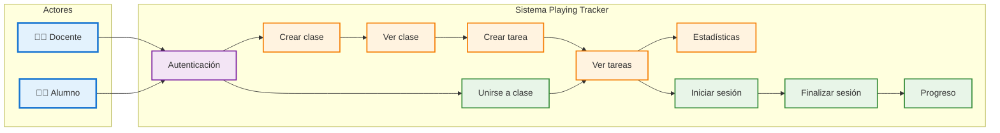
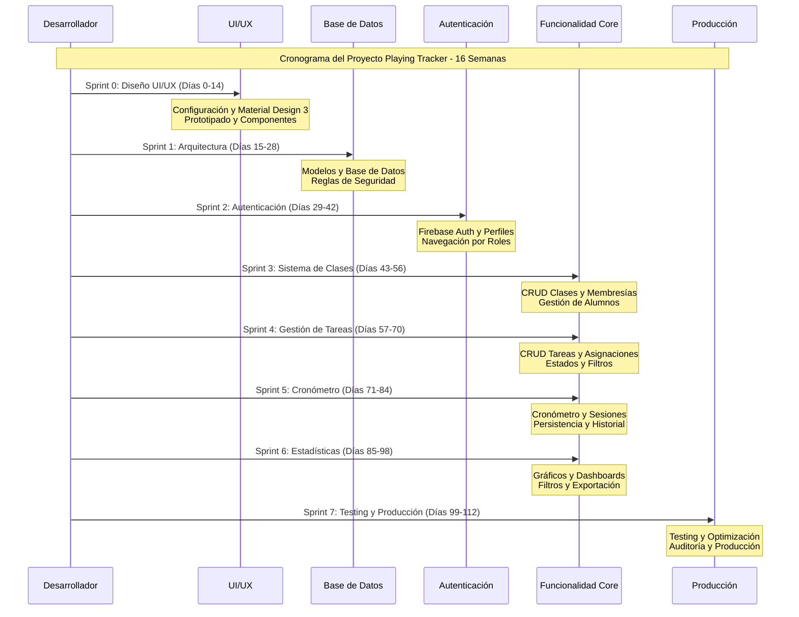

# 📋 Análisis de Requisitos y Fase de Diseño - Playing Tracker

**Proyecto:** Playing Tracker - Sistema de Seguimiento de Estudio Musical
**Fecha:** Octubre 2025
**Versión:** 1.0

---

## 1. Documento de análisis de requisitos

### 1.1. Introducción
La introducción debe proporcionar una visión general de la Especificación de Requerimientos.

#### 1.1.1. Propósito
Esta sección indica el propósito de la Especificación de Requerimientos de Software (ERS) para el proyecto Playing Tracker y la audiencia esperada para este documento. El objetivo principal es definir de manera clara y concisa los requisitos funcionales y no funcionales del sistema, sirviendo como base para el diseño, desarrollo y verificación del software. La audiencia incluye desarrolladores, testers, stakeholders del proyecto y futuros mantenedores.

#### 1.1.2. Alcance
Este documento especifica los requisitos para el producto de software "Playing Tracker", una aplicación móvil desarrollada con Flutter y Firebase. Playing Tracker permitirá a docentes gestionar clases y tareas, y a alumnos registrar su tiempo de estudio y progreso. El producto busca optimizar la gestión académica y el seguimiento del rendimiento del estudiante en actividades de práctica. No se abordarán funcionalidades de gestión de pagos o integración con sistemas externos de gestión académica (LMS) en esta fase inicial.

#### 1.1.3. Definiciones, siglas y abreviaturas
Esta sección proporciona las definiciones de todos los términos, las siglas y abreviaciones requeridas para interpretar apropiadamente el documento ERS.

*   **ERS**: Especificación de Requerimientos de Software
*   **UI/UX**: Interfaz de Usuario / Experiencia de Usuario
*   **CRUD**: Create, Read, Update, Delete
*   **NoSQL**: Not Only SQL (tipo de base de datos)
*   **Firebase**: Plataforma de desarrollo de Google para aplicaciones móviles y web.
*   **Firestore**: Base de datos NoSQL de Firebase.
*   **Flutter**: Framework de UI de Google para construir aplicaciones multiplataforma.
*   **Cubit**: Patrón de gestión de estado para Flutter, parte de la librería `flutter_bloc`.
*   **Docente**: Usuario con rol de profesor/administrador de clases.
*   **Alumno**: Usuario con rol de estudiante.
*   **UID**: User ID (identificador único de usuario en Firebase Authentication).
*   **API**: Application Programming Interface.
*   **QA**: Quality Assurance (Aseguramiento de Calidad).
*   **RGPD/LOPDGDD**: Reglamento General de Protección de Datos / Ley Orgánica de Protección de Datos Personales y garantía de los derechos digitales.

#### 1.1.4. Referencias
Esta sección proporciona una lista completa de todos los documentos a los que se hace referencia en el documento ERS.

*   **Guía del Proyecto Playing Tracker (`Guia_Proyecto_PlayingTracker.md`)**: Documento principal de especificaciones técnicas y metodología del proyecto.
*   **Reglas de Estilo Flutter (`flutter_style_rules.mdc`)**: Guía de codificación y buenas prácticas para el desarrollo en Flutter.
*   **Documentación oficial de Flutter**: [https://docs.flutter.dev/](https://docs.flutter.dev/)
*   **Documentación oficial de Firebase**: [https://firebase.google.com/docs](https://firebase.google.com/docs)
*   **Documentación oficial de Cubit/Bloc**: [https://bloclibrary.dev/](https://bloclibrary.dev/)
*   **Especificación de Requerimientos de Software (IEEE 830)**: Estándar para la creación de documentos ERS.

#### 1.1.5. Visión general
Este documento ERS está organizado en cinco secciones principales. La Sección 1, Introducción, establece el propósito, alcance, definiciones y referencias del documento. La Sección 2, Descripción General, proporciona una visión de alto nivel del producto, sus interfaces, funciones y restricciones. La Sección 3, Requerimientos Específicos, detalla los requisitos funcionales y no funcionales, incluyendo los casos de uso. La Sección 4, Requerimientos de Documentación, describe la documentación adicional necesaria para el proyecto. Finalmente, la Sección 5, Información de Soporte, incluye apéndices e índices opcionales.

### 1.2. Descripción general
Esta sección describe los factores generales que afectan al producto y sus requerimientos, proporcionando una base para los requerimientos específicos que se definen en detalle en la sección 3.

#### 1.2.1. Perspectiva del producto
Playing Tracker es una aplicación móvil independiente diseñada para funcionar en plataformas iOS y Android. Se integra con Firebase como su backend principal, utilizando Firebase Authentication para la gestión de usuarios y Cloud Firestore para la persistencia de datos.

**Interfases de usuario**
Esta sección describe las interfases de usuario que se deben implementar. Incluye las características lógicas de cada interfase entre el producto de software y el usuario que son necesarias para lograr los requerimientos del software, por ejemplo, formatos de pantalla, contenido de reportes y menús, o disponibilidad de teclas de función. Además incluye aspectos para optimizar la interfase, que puede ser una lista de como debe aparecer el sistema al usuario o como no debe aparecer, por ejemplo, que aparezcan mensajes de error cortos o largos.

La aplicación seguirá los principios de Material Design 3 para una experiencia de usuario consistente y moderna en ambas plataformas. Se priorizará la claridad, la facilidad de navegación y la retroalimentación visual para el usuario. Los mensajes de error serán concisos y útiles, guiando al usuario hacia una solución.

**Flujo de Navegación Principal:**
```
Splash Screen
    ↓
Login/Register
    ↓
Home (según rol)
    ├── Docente: Dashboard → Clases → Tareas → Estadísticas
    └── Alumno: Dashboard → Tareas → Cronómetro → Progreso
```

**Pantallas Principales:**
- **Pantalla de Login:** Logo, campos email/contraseña, botón login, enlace registro
- **Pantalla de Registro:** Formulario completo (nombre, apellidos, email, contraseña, rol)
- **Home Docente:** Cards de clases, botón crear clase, estadísticas rápidas
- **Home Alumno:** Lista de tareas pendientes, cronómetro rápido, progreso
- **Pantalla de Cronómetro:** Cronómetro grande, controles (iniciar/pausar/finalizar), información de tarea

**Componentes Reutilizables:**
- CustomButton: Botones con Material Design 3
- CustomTextField: Campos de texto con validaciones
- CustomCard: Cards para mostrar información
- LoadingOverlay: Indicadores de carga
- CustomAppBar: Barra de navegación personalizada

**Interfases con hardware**
Esta sección describe las características de las interfaces entre el producto de software y los componentes de hardware del sistema. Incluye características de configuración, dispositivos que se deben soportar, como deben ser soportados y protocolos.

La aplicación interactuará con el hardware del dispositivo móvil para funcionalidades básicas como la gestión de la pantalla táctil, notificaciones push (a través de Firebase Cloud Messaging) y, potencialmente, el acceso a la hora del sistema para el cronómetro. No se prevén interacciones complejas con sensores específicos o periféricos externos.

**Equipamiento de Desarrollo:** Para el desarrollo eficiente de Playing Tracker se requiere un ordenador de desarrollo de alta gama, específicamente un MacBook Pro M2 con 16GB de RAM y 512GB de SSD. Esta elección se justifica por la necesidad de compatibilidad nativa con iOS y Android, ya que Flutter requiere acceso a los SDKs de ambas plataformas.

**Dispositivos de Testing:** Para garantizar la calidad y compatibilidad de la aplicación, se necesitan dispositivos físicos de testing que representen los casos de uso más comunes. Se recomienda un iPhone 14 Pro para testing en iOS y un Samsung Galaxy S23 para testing en Android.

**Interfases con software**
En esta sección se debe especificar el uso de otros productos de software necesarios (sistema de manejo de datos, sistema operativo, librerías o paquetes), interfases con otros sistemas de aplicación. Para cada interfase se debe indicar: propósito de la interfase con el producto de software, definición de la interfase en términos de contenido y formato de la misma.

Playing Tracker se interconectará principalmente con los servicios de Firebase (Authentication, Firestore, Cloud Functions, Storage) y el sistema operativo subyacente (Android/iOS). Se utilizarán librerías y paquetes de Flutter para la construcción de la UI y la gestión de estado (Cubit).

**Software de Desarrollo Gratuito:** El stack tecnológico de Playing Tracker se basa principalmente en herramientas de código abierto y gratuitas. Flutter SDK 3.x servirá como framework principal, proporcionando desarrollo multiplataforma nativo. Android Studio será el IDE principal para desarrollo Android, mientras que VS Code con extensiones Flutter ofrecerá un entorno de desarrollo ligero y personalizable.

**Software de Pago Opcional:** Para optimizar el proceso de diseño y desarrollo, se recomienda Figma Pro (20€/mes) para la creación de prototipos de alta fidelidad y colaboración en el diseño. Firebase Blaze Plan será necesario para producción, operando bajo un modelo pay-as-you-go que se adapta al crecimiento del usuario.

**Interfases de comunicación**
En esta sección se describe cualquier interfase de comunicación con otro sistema o dispositivo como redes, dispositivos remotos, etc.

La aplicación se comunicará con los servicios de Firebase a través de la red de internet (Wi-Fi o datos móviles). Las comunicaciones se realizarán mediante los SDKs de Firebase, que gestionan la conexión segura y la sincronización de datos en tiempo real con Firestore.

**Infraestructura en la Nube:** Firebase proporcionará la infraestructura completa de backend para Playing Tracker, ofreciendo servicios gratuitos generosos que cubren las necesidades iniciales del proyecto. Firebase Authentication será completamente gratuito, Firestore proporciona 1GB de almacenamiento gratuito (luego $0.18/GB), Firebase Storage incluye 1GB gratuito (luego $0.026/GB), y Firebase Hosting es completamente gratuito.

**Restricciones de memoria**
En esta sección se deben especificar las características aplicables y límites en memoria primaria y secundaria.

La aplicación debe ser eficiente en el uso de memoria, especialmente en dispositivos móviles con recursos limitados. Se optimizará la carga de datos y recursos para minimizar el consumo de RAM y almacenamiento. Se evitará la carga excesiva de datos en memoria y se implementarán estrategias de paginación y caché cuando sea necesario.

**Requerimientos de adecuación al entorno**
En esta sección se deben especificar los requerimientos de datos o secuencias de inicialización que son específicas a un sitio dado, misión, o modo operacional (por ejemplo, valores posibles, límites de seguridad, etc.); se debe especificar el sitio o las características relacionadas a la misión que deben modificarse para adaptar el software a una instalación particular.

La aplicación está diseñada para un entorno global, con soporte inicial para el idioma español. No se prevén requerimientos específicos de localización geográfica o cultural más allá del idioma. Los datos iniciales de configuración se gestionarán a través de Firebase Remote Config o se cargarán directamente en Firestore.

#### 1.2.2. Funciones del producto
En esta sección se resumen las funciones más importantes que el software debe realizar.

Playing Tracker permitirá a los docentes crear y gestionar clases, asignar tareas a sus alumnos y supervisar su progreso. Los alumnos podrán unirse a clases, ver sus tareas asignadas, registrar el tiempo dedicado a cada tarea mediante un cronómetro y visualizar sus estadísticas de estudio. El sistema proporcionará un mecanismo de autenticación seguro para ambos roles.

**Funcionalidades Principales:**
- **Gestión de Usuarios y Autenticación:** Sistema robusto basado en Firebase Authentication con roles diferenciados (Docente/Alumno)
- **Gestión de Clases y Membresías:** Creación de clases virtuales con códigos de acceso únicos
- **Gestión de Tareas y Asignaciones:** Creación de tareas detalladas con mecanismo de fan-out optimizado
- **Cronómetro y Registro de Sesiones:** Cronómetro persistente con controles completos
- **Estadísticas y Reportes:** Visualizaciones detalladas del progreso con exportación de datos

#### 1.2.3. Características de los usuarios
En esta sección se describen las características generales de los usuarios del producto incluyendo nivel educacional, experiencia y especialización técnica.

Los usuarios de Playing Tracker se dividen en dos roles principales:

**Docentes:** Profesionales de la educación (profesores, tutores) con conocimientos básicos de tecnología, que necesitan una herramienta para organizar y seguir el rendimiento de sus alumnos. El proyecto requiere un desarrollador full-stack senior especializado en Flutter con un mínimo de 3 años de experiencia en desarrollo móvil y integración con Firebase.

**Alumnos:** Estudiantes de diversas edades (desde educación secundaria hasta universitaria) con familiaridad en el uso de aplicaciones móviles, que buscan una herramienta para gestionar sus tareas y monitorear su tiempo de estudio.

#### 1.2.4. Restricciones de diseño
En esta sección se describen los elementos que limitan las opciones de los desarrolladores. Las restricciones de diseño representan decisiones diseño que se han tomado y que se deben cumplir. Incluye lenguajes de programación, requerimientos de proceso de software, herramientas de desarrollo, limitaciones de hardware, funcionamiento paralelo, funciones de auditoria, funciones de control, protocolos, consideraciones de seguridad, criticidad de la aplicación, librerías, políticas de regulación, etc.

**Lenguaje de Programación**
**Descripción de la restricción:** Dart es el lenguaje de programación obligatorio para el desarrollo de la aplicación, ya que Flutter está construido sobre este lenguaje y proporciona las mejores características de rendimiento y compatibilidad multiplataforma.

**Framework de Desarrollo**
**Descripción de la restricción:** Flutter es el framework obligatorio para el desarrollo de la UI y la lógica de la aplicación, proporcionando desarrollo nativo multiplataforma con una sola base de código.

**Backend y Servicios**
**Descripción de la restricción:** Firebase es la plataforma obligatoria para todos los servicios de backend, incluyendo Authentication, Firestore, Cloud Functions y Storage, garantizando integración nativa y escalabilidad.

**Gestión de Estado**
**Descripción de la restricción:** Cubit (parte de `flutter_bloc`) es el patrón obligatorio para la gestión de estado, proporcionando simplicidad y mantenibilidad en comparación con Bloc.

**Diseño UI/UX**
**Descripción de la restricción:** Material Design 3 es el sistema de diseño obligatorio, garantizando consistencia visual y accesibilidad en ambas plataformas.

**Arquitectura de Datos**
**Descripción de la restricción:** Modelo NoSQL desanidado con fan-out y optimizaciones anti-hotspot en Firestore es obligatorio para garantizar escalabilidad y rendimiento.

**Seguridad y Cumplimiento**
**Descripción de la restricción:** Implementación de Firestore Security Rules robustas y cumplimiento estricto de RGPD/LOPDGDD es obligatorio para proteger datos de menores de edad.

**Presupuesto y Financiación**
**Descripción de la restricción:** El presupuesto total del proyecto asciende a 36,340€, distribuido en hardware (4,000€ si no se posee), software (340€/año), y personal (32,000€). El proyecto se financiará inicialmente mediante autofinanciación, permitiendo control total sobre el desarrollo y la propiedad intelectual.

**Estimación de Costes Operativos:** Los costes anuales de infraestructura se estiman entre 0-100€ dependiendo del crecimiento de usuarios, más 15€/año para el dominio de la aplicación. El modelo de pago por uso de Firebase se adapta perfectamente al crecimiento orgánico del proyecto.

#### 1.2.5. Supuestos y dependencias
Esta sección debe incluir una lista de todos los factores que afectan a los requerimientos establecidos. Estos factores no son restricciones de diseño para el software pero si hay cambios en estos factores pueden afectar los requerimientos establecidos.

*   **Conectividad a Internet:** Se asume que los usuarios tendrán acceso a internet para la mayoría de las funcionalidades de la aplicación (autenticación, sincronización de datos).
*   **Disponibilidad de Firebase:** La aplicación depende de la disponibilidad y el rendimiento de los servicios de Firebase.
*   **Actualizaciones de Flutter/Dart:** El desarrollo se adaptará a las actualizaciones y cambios en el framework Flutter y el lenguaje Dart.
*   **Cumplimiento normativo:** Se asume que las regulaciones de privacidad de datos (RGPD/LOPDGDD) se mantendrán estables o que cualquier cambio será gestionable.

### 1.3. Requerimientos específicos
Esta sección de la Especificación de Requerimientos de Software debe contener todos los requerimientos del software a un nivel de detalle suficiente para permitir a diseñadores diseñar un sistema para satisfacer esos requerimientos y a verificadores probar que el sistema satisface esos requerimientos. Al usar el modelo de casos de uso, estos requisitos se capturan en los casos de uso y las especificaciones suplementarias aplicables.

#### 1.3.1. Requerimientos Funcionales

El sistema Playing Tracker debe proporcionar un conjunto completo de funcionalidades que permitan a los docentes gestionar eficientemente sus clases y tareas, mientras que los alumnos puedan registrar y seguir su progreso de estudio de manera objetiva y motivadora.

**Gestión de Usuarios y Autenticación (RF-001):** El sistema implementará un sistema de autenticación robusto basado en Firebase Authentication que permitirá el registro de usuarios con dos roles diferenciados: Docente y Alumno. Los docentes podrán crear y gestionar múltiples clases, mientras que los alumnos se unirán a las clases mediante códigos de acceso únicos. El sistema incluirá funcionalidades de recuperación de contraseñas y gestión completa de perfiles de usuario, garantizando la seguridad y privacidad de los datos personales.

**Gestión de Clases y Membresías (RF-002):** Los docentes tendrán la capacidad de crear clases virtuales con nombres descriptivos y códigos de acceso únicos de 6 caracteres alfanuméricos. El sistema generará automáticamente estos códigos asegurando su unicidad. Los alumnos podrán unirse a las clases introduciendo el código correspondiente, estableciendo así una relación de membresía que permitirá al docente gestionar su grupo de estudiantes de manera eficiente.

**Gestión de Tareas y Asignaciones (RF-003):** El núcleo del sistema radica en la capacidad de los docentes para crear tareas detalladas que incluyan título, descripción completa, tiempo sugerido de estudio en minutos, y archivos adjuntos opcionales (PDFs, archivos de audio, o enlaces externos). Las tareas podrán ser asignadas tanto a clases completas como a alumnos específicos, permitiendo una personalización del aprendizaje. El sistema implementará un mecanismo de fan-out optimizado para crear automáticamente las asignaciones individuales cuando se asigna una tarea a una clase completa.

**Cronómetro y Registro de Sesiones (RF-004):** Los alumnos dispondrán de un cronómetro funcional y persistente que les permitirá registrar su tiempo de estudio con controles completos: iniciar, pausar, reiniciar y finalizar sesiones. El sistema registrará automáticamente cada sesión de estudio, incluyendo la duración total, tiempo en pausa, y notas opcionales del alumno. La persistencia en segundo plano garantizará que el cronómetro continúe funcionando incluso si el usuario cambia de aplicación o recibe una llamada telefónica.

**Estadísticas y Reportes (RF-005):** El sistema generará estadísticas detalladas y visualizaciones atractivas del progreso de estudio, tanto para docentes como para alumnos. Los docentes podrán acceder a dashboards que muestren el progreso de todos sus alumnos, con filtros por fecha, tarea específica, o clase. Los alumnos tendrán acceso a su progreso personal con gráficos que muestren su evolución temporal. El sistema incluirá funcionalidades de exportación de datos en formatos CSV y PDF para análisis externos o reportes institucionales.

#### 1.3.2. Requerimientos Suplementarios
Las especificaciones suplementarias capturan requerimientos que no se incluyen en los casos de uso (requerimientos necesarios para el uso del sistema, como son performance, mantenibilidad, usabilidad, fiabilidad, soporte, funcionalidad, requerimientos de autorización o licenciamiento, estándares aplicables, etc.). Los requerimientos suplementarios deben ser incluidos aquí y refinados al nivel necesario de detalle. Cada requerimiento debe estar identificado únicamente.

**Rendimiento y Eficiencia (RNF-001):** El sistema debe garantizar tiempos de respuesta inferiores a 2 segundos para todas las operaciones CRUD (crear, leer, actualizar, eliminar), asegurando una experiencia fluida para los usuarios. La arquitectura debe soportar un mínimo de 1000 usuarios concurrentes sin degradación del rendimiento, implementando optimizaciones como índices compuestos en Firestore, cache inteligente de datos frecuentemente accedidos, y técnicas de paginación para listas extensas. El cronómetro debe mantener una precisión de milisegundos y actualizar la interfaz de usuario cada segundo sin afectar el rendimiento general de la aplicación.

**Seguridad y Privacidad (RNF-002):** La seguridad del sistema es crítica dado que maneja datos de menores de edad. Todas las operaciones requerirán autenticación obligatoria, implementando reglas de seguridad granulares que restringen el acceso a datos según el rol del usuario. Los datos se cifrarán tanto en tránsito (HTTPS/TLS) como en reposo (cifrado de Firestore), y el sistema cumplirá estrictamente con el RGPD y la LOPDGDD, incluyendo funcionalidades de consentimiento explícito, derecho al olvido, y portabilidad de datos. Las contraseñas se almacenarán con hash seguro y se implementará autenticación de dos factores como opción adicional.

**Usabilidad y Accesibilidad (RNF-003):** La interfaz de usuario seguirá los principios de Material Design 3, proporcionando una experiencia moderna e intuitiva que se adapte tanto a usuarios jóvenes como adultos. El sistema incluirá soporte completo para temas claro y oscuro, con transiciones suaves entre modos. La accesibilidad será una prioridad, garantizando un contraste mínimo de 4.5:1 para textos normales y 3:1 para textos grandes, soporte completo para TalkBack (Android) y VoiceOver (iOS), y áreas de toque mínimas de 48x48 dp para todos los elementos interactivos. La navegación será fluida con animaciones de 300ms y feedback táctil apropiado.

**Escalabilidad y Mantenibilidad (RNF-004):** La arquitectura NoSQL estará optimizada para evitar hotspots mediante la distribución inteligente de datos y el uso de claves compuestas. El sistema implementará un mecanismo de fan-out eficiente que permita asignar tareas a clases de hasta 100 alumnos simultáneamente sin degradación del rendimiento. La escalabilidad horizontal en Firebase permitirá el crecimiento orgánico del sistema, y la arquitectura modular facilitará el mantenimiento y la adición de nuevas funcionalidades sin afectar el código existente.

#### 1.3.3. Diagrama de Casos de Uso General

El sistema Playing Tracker interactúa con tres tipos de actores principales que representan los diferentes roles y entidades involucradas en el proceso educativo musical:

**Docente:** Representa al profesor de música que utiliza la aplicación para gestionar sus clases, crear tareas, asignar actividades a sus alumnos, y supervisar el progreso de estudio. El docente tiene permisos administrativos completos sobre las clases que crea y puede acceder a estadísticas detalladas de todos sus alumnos.

**Alumno:** Representa al estudiante de música que utiliza la aplicación para acceder a sus tareas asignadas, registrar sesiones de estudio mediante el cronómetro, y consultar su progreso personal. El alumno tiene permisos limitados a sus propios datos y tareas asignadas, garantizando la privacidad y seguridad de la información.

**Sistema:** Representa la aplicación Playing Tracker y sus componentes internos que procesan automáticamente los datos, generan estadísticas, envían notificaciones, y mantienen la sincronización entre dispositivos.



#### 1.3.4. Descripción Individual de Casos de Uso

#### UC-001: Autenticación de Usuario

| Campo | Descripción |
|-------|-------------|
| **Descripción breve** | El usuario se autentica en el sistema Playing Tracker utilizando sus credenciales de email y contraseña, siendo redirigido automáticamente a la interfaz correspondiente según su rol (docente o alumno). |
| **Precondiciones** | El usuario debe estar registrado previamente en el sistema con un email válido y contraseña. La aplicación debe estar instalada y funcionando correctamente en el dispositivo del usuario. |
| **Pasos habituales** | 1. El usuario abre la aplicación Playing Tracker. 2. El sistema presenta la pantalla de login con campos para email y contraseña. 3. El usuario introduce sus credenciales y presiona el botón "Iniciar Sesión". 4. El sistema valida las credenciales contra Firebase Authentication. 5. Si las credenciales son correctas, el sistema consulta el rol del usuario en Firestore. 6. El sistema redirige al usuario a la pantalla home correspondiente (docente o alumno). 7. El sistema establece la sesión activa y carga los datos del usuario. |
| **Postcondiciones** | El usuario está autenticado en el sistema con su sesión activa. Se ha cargado su perfil completo con nombre, apellidos, email y rol. El usuario puede acceder a todas las funcionalidades permitidas según su rol. |
| **Excepciones** | Si las credenciales son incorrectas, el sistema muestra un mensaje de error específico. Si el usuario no existe, se ofrece la opción de registro. Si hay problemas de conectividad, se muestra un mensaje de error de red. Si el usuario está desactivado, se informa del estado de la cuenta. |

#### UC-002: Crear Clase (Docente)

| Campo | Descripción |
|-------|-------------|
| **Descripción breve** | El docente crea una nueva clase virtual en el sistema, definiendo su nombre, descripción opcional, y obteniendo automáticamente un código de acceso único que podrá compartir con sus alumnos para que se unan a la clase. |
| **Precondiciones** | El docente debe estar autenticado en el sistema con rol de docente. Debe tener conexión a internet activa. No debe existir una clase con el mismo nombre creada por el mismo docente. |
| **Pasos habituales** | 1. El docente accede a la pantalla "Mis Clases" desde el menú principal. 2. Presiona el botón "Crear Nueva Clase". 3. El sistema presenta un formulario con campos para nombre de clase y descripción opcional. 4. El docente introduce el nombre de la clase (mínimo 3 caracteres) y una descripción opcional. 5. Presiona el botón "Crear Clase". 6. El sistema valida los datos introducidos. 7. El sistema genera automáticamente un código de acceso único de 6 caracteres alfanuméricos. 8. El sistema crea el documento de clase en Firestore con todos los datos. 9. El sistema muestra la nueva clase creada con su código de acceso. |
| **Postcondiciones** | Se ha creado una nueva clase en el sistema con un identificador único. La clase tiene un código de acceso único generado automáticamente. El docente puede ver la clase en su lista de clases. La clase está activa y lista para que los alumnos se unan. |
| **Excepciones** | Si el nombre de la clase ya existe para el mismo docente, se muestra un mensaje de error pidiendo un nombre diferente. Si hay problemas de conectividad, se informa del error y se sugiere reintentar. Si el formulario está incompleto, se resaltan los campos obligatorios. Si hay un error interno del sistema, se muestra un mensaje genérico de error. |

#### UC-003: Unirse a Clase (Alumno)

| Campo | Descripción |
|-------|-------------|
| **Descripción breve** | El alumno se une a una clase existente introduciendo el código de acceso proporcionado por su docente, estableciendo así una relación de membresía que le permitirá acceder a las tareas y actividades de esa clase. |
| **Precondiciones** | El alumno debe estar autenticado en el sistema con rol de alumno. Debe tener un código de acceso válido proporcionado por un docente. La clase debe existir y estar activa en el sistema. El alumno no debe estar ya unido a esa clase. |
| **Pasos habituales** | 1. El alumno accede a la pantalla "Unirse a Clase" desde el menú principal. 2. El sistema presenta un campo de texto para introducir el código de acceso. 3. El alumno introduce el código de 6 caracteres proporcionado por su docente. 4. Presiona el botón "Unirse a Clase". 5. El sistema valida el formato del código (6 caracteres alfanuméricos). 6. El sistema busca la clase correspondiente al código en Firestore. 7. Si la clase existe y está activa, el sistema crea un documento de membresía. 8. El sistema actualiza la lista de clases del alumno. 9. El sistema muestra un mensaje de confirmación de unión exitosa. |
| **Postcondiciones** | El alumno se ha unido exitosamente a la clase. Se ha creado una relación de membresía en el sistema. El alumno puede ver la clase en su lista de clases. El alumno puede acceder a las tareas asignadas a esa clase. El docente puede ver al alumno en la lista de miembros de la clase. |
| **Excepciones** | Si el código introducido no existe, se muestra un mensaje de error indicando que el código es inválido. Si la clase está desactivada, se informa que la clase no está disponible. Si el alumno ya está unido a la clase, se muestra un mensaje informativo. Si hay problemas de conectividad, se sugiere verificar la conexión e intentar nuevamente. |

#### UC-004: Crear Tarea (Docente)

| Campo | Descripción |
|-------|-------------|
| **Descripción breve** | El docente crea una nueva tarea de estudio definiendo todos sus detalles (título, descripción, tiempo sugerido, archivos adjuntos) y la asigna a una clase completa o a alumnos específicos, generando automáticamente las asignaciones individuales correspondientes. |
| **Precondiciones** | El docente debe estar autenticado con rol de docente. Debe tener al menos una clase creada o alumnos disponibles para asignar. Debe tener conexión a internet activa. Los datos de la tarea deben cumplir con las validaciones establecidas. |
| **Pasos habituales** | 1. El docente accede a la pantalla "Crear Tarea" desde el menú de gestión de tareas. 2. El sistema presenta un formulario completo con todos los campos necesarios. 3. El docente introduce el título de la tarea (mínimo 5 caracteres). 4. El docente escribe una descripción detallada de la tarea (mínimo 10 caracteres). 5. El docente especifica el tiempo sugerido de estudio en minutos (mínimo 5, máximo 480). 6. Opcionalmente, el docente adjunta archivos (PDF, audio) o enlaces externos. 7. El docente selecciona los destinatarios: clase completa o alumnos específicos. 8. Opcionalmente, el docente establece una fecha límite para la tarea. 9. El docente presiona el botón "Crear y Asignar Tarea". 10. El sistema valida todos los datos introducidos. 11. El sistema crea el documento de tarea en Firestore. 12. El sistema ejecuta el fan-out para crear las asignaciones individuales. 13. El sistema muestra confirmación de creación exitosa. |
| **Postcondiciones** | Se ha creado una nueva tarea en el sistema con identificador único. La tarea ha sido asignada a todos los destinatarios seleccionados. Cada alumno destinatario tiene una asignación individual creada. Los alumnos pueden ver la nueva tarea en su lista de tareas pendientes. El docente puede gestionar la tarea desde su panel de control. |
| **Excepciones** | Si algún campo obligatorio está vacío, se resaltan los campos faltantes. Si el tiempo sugerido está fuera del rango permitido, se muestra un mensaje de error específico. Si hay problemas durante el fan-out, se informa del error y se sugiere reintentar. Si los archivos adjuntos exceden el tamaño permitido, se informa del límite. Si no hay destinatarios disponibles, se sugiere crear una clase o agregar alumnos. |

#### UC-005: Iniciar Sesión de Estudio (Alumno)

| Campo | Descripción |
|-------|-------------|
| **Descripción breve** | El alumno inicia una sesión de estudio cronometrada para una tarea específica, activando el cronómetro persistente que registrará automáticamente el tiempo dedicado al estudio, incluso si la aplicación pasa a segundo plano. |
| **Precondiciones** | El alumno debe estar autenticado con rol de alumno. Debe tener al menos una tarea asignada con estado "pending" o "in_progress". No debe tener una sesión activa en curso. Debe tener conexión a internet para el registro inicial. |
| **Pasos habituales** | 1. El alumno accede a su lista de tareas desde el menú principal. 2. El alumno selecciona una tarea específica de la lista. 3. El sistema muestra los detalles de la tarea y el botón "Iniciar Estudio". 4. El alumno presiona el botón "Iniciar Estudio". 5. El sistema presenta la pantalla de cronómetro con controles de estudio. 6. El sistema registra el inicio de la sesión con timestamp preciso. 7. El sistema inicia el cronómetro y lo mantiene activo. 8. El sistema actualiza el estado de la asignación a "in_progress". 9. El alumno puede pausar, reanudar o finalizar la sesión en cualquier momento. |
| **Postcondiciones** | Se ha iniciado una sesión de estudio activa para la tarea seleccionada. El cronómetro está funcionando y registrando el tiempo transcurrido. El estado de la asignación se ha actualizado a "in_progress". El sistema está preparado para persistir la sesión en segundo plano. El alumno puede ver el tiempo transcurrido en tiempo real. |
| **Excepciones** | Si la tarea no está disponible, se muestra un mensaje explicativo. Si ya hay una sesión activa, se informa y se ofrece la opción de finalizarla primero. Si hay problemas de conectividad, se inicia la sesión en modo offline. Si la tarea ha expirado, se informa del estado y se sugiere contactar al docente. |

#### UC-006: Finalizar Sesión de Estudio (Alumno)

| Campo | Descripción |
|-------|-------------|
| **Descripción breve** | El alumno finaliza su sesión de estudio cronometrada, confirmando la finalización y permitiendo al sistema calcular la duración total, actualizar las estadísticas, y registrar la sesión completada en la base de datos. |
| **Precondiciones** | Debe existir una sesión de estudio activa iniciada previamente. El cronómetro debe estar funcionando y haber registrado al menos 1 minuto de tiempo. El alumno debe estar autenticado y tener conexión a internet para sincronizar los datos. |
| **Pasos habituales** | 1. El alumno está en la pantalla de cronómetro con una sesión activa. 2. El alumno presiona el botón "Finalizar Sesión". 3. El sistema presenta una pantalla de confirmación mostrando el tiempo total registrado. 4. El alumno puede agregar notas opcionales sobre la sesión de estudio. 5. El alumno confirma la finalización presionando "Confirmar". 6. El sistema calcula la duración total de la sesión (tiempo activo menos pausas). 7. El sistema crea el documento de sesión en Firestore con todos los datos. 8. El sistema actualiza las estadísticas del alumno (sesiones totales, tiempo total). 9. El sistema actualiza el progreso de la asignación correspondiente. 10. El sistema muestra un mensaje de confirmación y regresa a la lista de tareas. |
| **Postcondiciones** | La sesión de estudio ha sido registrada exitosamente en la base de datos. Las estadísticas del alumno se han actualizado con la nueva sesión. El progreso de la tarea se ha actualizado con el tiempo adicional registrado. El cronómetro se ha detenido y la sesión ya no está activa. El alumno puede ver la sesión en su historial personal. |
| **Excepciones** | Si el tiempo registrado es menor a 1 minuto, se sugiere continuar estudiando. Si hay problemas de conectividad, se guarda localmente y se sincroniza cuando se recupere la conexión. Si hay errores al guardar, se informa del problema y se sugiere reintentar. Si la sesión ya fue finalizada, se muestra un mensaje informativo. |

#### UC-007: Consultar Estadísticas de Progreso (Docente/Alumno)

| Campo | Descripción |
|-------|-------------|
| **Descripción breve** | El usuario (docente o alumno) consulta estadísticas detalladas de progreso de estudio, aplicando filtros específicos según sus necesidades, y visualizando gráficos y métricas que le permiten evaluar el rendimiento y evolución del aprendizaje musical. |
| **Precondiciones** | El usuario debe estar autenticado en el sistema. Debe existir al menos una sesión de estudio registrada para generar estadísticas. Para docentes, debe tener al menos una clase con alumnos activos. Para alumnos, debe tener al menos una tarea asignada y una sesión completada. |
| **Pasos habituales** | 1. El usuario accede a la sección "Estadísticas" desde el menú principal. 2. El sistema presenta la pantalla de estadísticas con filtros disponibles. 3. El usuario selecciona el período de tiempo (última semana, mes, trimestre, año). 4. Para docentes: selecciona la clase específica o "todas las clases". 5. Para alumnos: selecciona la tarea específica o "todas las tareas". 6. El usuario aplica filtros adicionales (días de la semana, horas del día). 7. El sistema consulta los datos correspondientes en Firestore. 8. El sistema genera gráficos y métricas en tiempo real. 9. El usuario visualiza las estadísticas con gráficos interactivos. 10. El usuario puede exportar los datos en formato CSV o PDF. |
| **Postcondiciones** | Se han mostrado las estadísticas solicitadas con los filtros aplicados. Los gráficos son interactivos y permiten exploración detallada. Los datos están actualizados y reflejan el estado actual del progreso. El usuario puede exportar la información para análisis externo. Las métricas son precisas y basadas en datos reales de sesiones registradas. |
| **Excepciones** | Si no hay datos suficientes para el período seleccionado, se muestra un mensaje informativo y se sugieren otros períodos. Si hay problemas de conectividad, se muestran los datos en caché con indicador de actualización pendiente. Si los filtros no devuelven resultados, se sugiere ampliar el rango de búsqueda. Si hay errores en la generación de gráficos, se muestran los datos en formato tabular. |

#### 1.3.5. Planificación del Proyecto

El proyecto Playing Tracker se desarrollará siguiendo una metodología Scrum adaptada con un enfoque de "diseño primero", priorizando la experiencia de usuario desde las primeras fases del desarrollo. El alcance del proyecto abarca 8 sprints de 2 semanas cada uno, totalizando 16 semanas de desarrollo intensivo con un equipo de un desarrollador full-stack especializado en Flutter y Firebase.

**Metodología y Enfoque:** La metodología adoptada combina los principios ágiles de Scrum con un enfoque centrado en el diseño, donde las primeras dos semanas se dedicarán exclusivamente a la creación de prototipos de alta fidelidad y la implementación del sistema de diseño Material Design 3. Este enfoque garantiza que todas las decisiones de UX/UI estén tomadas antes de comenzar la implementación de la lógica de negocio, reduciendo significativamente los riesgos de rework y mejorando la calidad final del producto.

**Cronograma Detallado:** El Sprint 0 se centrará en la configuración del proyecto, implementación del sistema de diseño Material Design 3, prototipado completo de todas las pantallas, y desarrollo de los componentes base reutilizables. El Sprint 1 abordará la arquitectura de datos, implementando las 7 colecciones de Firestore, modelos de dominio, reglas de seguridad, e índices optimizados. Los Sprints 2-4 cubrirán la funcionalidad core: autenticación, sistema de clases y membresías, y gestión completa de tareas. Los Sprints 5-6 implementarán las funcionalidades avanzadas: cronómetro persistente y sistema de estadísticas. El Sprint 7 se dedicará al testing exhaustivo, optimización de rendimiento, auditoría de seguridad, y preparación para producción.

**Estimación de Costes:** El coste total del proyecto se estima en 32,000€, calculado sobre la base de 16 semanas de desarrollo a 40 horas semanales con una tarifa de 50€/hora para un desarrollador senior especializado en Flutter. Esta estimación incluye el desarrollo completo de la aplicación, pero excluye costes de infraestructura (Firebase ofrece un tier gratuito generoso) y herramientas de desarrollo (Flutter, Android Studio, VS Code son gratuitas). El presupuesto es competitivo para una aplicación de esta complejidad y alcance, especialmente considerando la calidad y escalabilidad de la solución propuesta.



**Metodología de Seguimiento:** Cada sprint incluye entregables específicos y medibles, con revisiones semanales para asegurar el cumplimiento de los objetivos. El diagrama muestra las dependencias entre tareas, permitiendo una gestión eficiente de recursos y la identificación temprana de posibles retrasos. Las actividades están distribuidas de manera que permitan testing continuo y feedback iterativo, garantizando la calidad del producto final.

### 1.4. Requerimientos de documentación
En esta sección se especifica el tipo de documentación que se requiere, el contenido y formato de la misma.

#### 1.4.1. Manual de Usuario
En esta sección describa el propósito y contenido del Manual de Usuario. Especifique el largo deseado, nivel de detalle, necesidad de índice, glosario de términos, tutoriales o manual de referencia estratégica, etc. Especifique también restricciones de formato e impresión.

El manual de usuario proporcionará instrucciones claras y concisas para docentes y alumnos sobre cómo utilizar la aplicación, desde la creación de cuentas hasta la gestión de tareas y la visualización de estadísticas. Incluirá capturas de pantalla, un índice y un glosario de términos clave. Se diseñará para ser accesible y fácil de entender para usuarios con diferentes niveles de habilidad tecnológica.

#### 1.4.2. Ayuda en línea
En esta sección especifique si el sistema de software incluye un sistema de ayuda en línea. Si lo incluye especifique los requerimientos de organización y presentación del mismo.

La aplicación incluirá un sistema de ayuda en línea contextual, accesible desde las pantallas relevantes. Este sistema ofrecerá respuestas a preguntas frecuentes y guías rápidas sobre funcionalidades específicas. La información se organizará de forma jerárquica y se presentará de manera clara y concisa.

#### 1.4.3. Guías de instalación, configuración y archivo Léame
En esta sección especifique si el sistema de software contendrá instrucciones para instalación y configuración. Además si se incluirá el típico archivo Léame, que puede incluir las Novedades de la versión, discusión de compatibilidad con versiones anteriores, documentación de errores conocidos y soluciones alternativas.

Se proporcionarán guías de instalación y configuración para las plataformas iOS y Android, detallando los pasos para descargar la aplicación desde las tiendas oficiales. Un archivo `README.md` en el repositorio del proyecto contendrá información sobre la configuración del entorno de desarrollo, dependencias, novedades de la versión y posibles problemas conocidos.

#### 1.4.4. Etiquetado y empaquetado
El estado del arte de las aplicaciones de hoy proporciona un aspecto consistente que comienza con el paquete del producto y se manifiesta a través de los menús de la instalación, las pantallas del sistema, los sistemas de ayuda, los diálogos con el usuario, etc. Esta sección define las necesidades y tipos de etiquetas a para ser incorporado en el código, por ejemplo, derechos de propiedad literaria y avisos patentes, logotipos corporativos, iconos estandarizados y otros elementos gráficos, etc.

La aplicación incluirá el logotipo de Playing Tracker, iconos estandarizados de Material Design 3 y avisos de derechos de autor en el pie de página y en la sección "Acerca de". El empaquetado de la aplicación en las tiendas de aplicaciones seguirá las directrices de marca y contendrá descripciones claras, capturas de pantalla y videos promocionales.

### 1.5. Información de soporte (opcional)
La información de soporte hace que el documento sea más fácil de usar. Puede incluir:
*   Apéndices
*   Índice

#### 1.5.1. Apéndices

##### 1.5.1.1. Diseño de la Base de Datos NoSQL

##### Modelo de Datos NoSQL (Firestore)

**Tipo de Base de Datos:** Document-store (Firestore)
**Justificación:** Escalabilidad, flexibilidad, integración con Firebase

##### Entidades Principales

**1. Teachers (Docentes)**
```json
{
  "id": "string (UID)",
  "firstName": "string (obligatorio)",
  "lastName": "string (obligatorio)",
  "email": "string (obligatorio, único)",
  "createdAt": "timestamp (obligatorio)",
  "updatedAt": "timestamp (obligatorio)",
  "isActive": "boolean (obligatorio, default: true)"
}
```

**2. Students (Alumnos)**
```json
{
  "id": "string (UID)",
  "firstName": "string (obligatorio)",
  "lastName": "string (obligatorio)",
  "email": "string (obligatorio, único)",
  "createdAt": "timestamp (obligatorio)",
  "updatedAt": "timestamp (obligatorio)",
  "isActive": "boolean (obligatorio, default: true)",
  "totalSessionsCount": "number (obligatorio, default: 0)",
  "totalDurationLogged": "number (obligatorio, default: 0)",
  "lastSessionDate": "timestamp (opcional)"
}
```

**3. Classes (Clases)**
```json
{
  "id": "string (obligatorio, único)",
  "name": "string (obligatorio)",
  "description": "string (opcional)",
  "ownerTeacherId": "string (obligatorio)",
  "accessCode": "string (obligatorio, único, 6 caracteres)",
  "createdAt": "timestamp (obligatorio)",
  "updatedAt": "timestamp (obligatorio)",
  "isActive": "boolean (obligatorio, default: true)"
}
```

**4. Memberships (Membresías)**
```json
{
  "id": "string (obligatorio, único)",
  "classId": "string (obligatorio)",
  "studentId": "string (obligatorio)",
  "teacherId": "string (obligatorio)",
  "className": "string (obligatorio)",
  "joinedAt": "timestamp (obligatorio)",
  "isActive": "boolean (obligatorio, default: true)"
}
```

**5. Tasks (Tareas)**
```json
{
  "id": "string (obligatorio, único)",
  "title": "string (obligatorio)",
  "description": "string (obligatorio)",
  "createdBy": "string (obligatorio)",
  "durationSuggested": "number (obligatorio, minutos)",
  "attachments": "array (opcional)",
  "createdAt": "timestamp (obligatorio)",
  "updatedAt": "timestamp (obligatorio)",
  "dueDate": "timestamp (opcional)",
  "isActive": "boolean (obligatorio, default: true)"
}
```

**6. Assignments (Asignaciones)**
```json
{
  "id": "string (obligatorio, formato: taskId_studentId)",
  "taskId": "string (obligatorio)",
  "studentId": "string (obligatorio)",
  "teacherId": "string (obligatorio)",
  "status": "string (obligatorio, enum: pending|in_progress|completed)",
  "assignedAt": "timestamp (obligatorio)",
  "completedAt": "timestamp (opcional)",
  "sessionsCount": "number (obligatorio, default: 0)",
  "totalDurationLogged": "number (obligatorio, default: 0)",
  "lastSessionDate": "timestamp (opcional)"
}
```

**7. Sessions (Sesiones)**
```json
{
  "id": "string (obligatorio, único)",
  "studentId": "string (obligatorio)",
  "taskId": "string (obligatorio)",
  "teacherId": "string (obligatorio)",
  "startTime": "timestamp (obligatorio)",
  "endTime": "timestamp (obligatorio)",
  "totalDuration": "number (obligatorio, segundos)",
  "pausedDuration": "number (obligatorio, default: 0)",
  "dateLogged": "timestamp (obligatorio)",
  "monthBucket": "string (obligatorio, formato: YYYY-MM)",
  "notes": "string (opcional)",
  "createdAt": "timestamp (obligatorio)"
}
```

##### Ejemplos de Documentos

**Ejemplo 1: Teacher**
```json
{
  "id": "teacher_123",
  "firstName": "María",
  "lastName": "García López",
  "email": "maria.garcia@conservatorio.com",
  "createdAt": "2025-10-15T10:30:00Z",
  "updatedAt": "2025-10-15T10:30:00Z",
  "isActive": true
}
```

**Ejemplo 2: Student con Agregados**
```json
{
  "id": "student_456",
  "firstName": "Carlos",
  "lastName": "Rodríguez Martín",
  "email": "carlos.rodriguez@estudiante.com",
  "createdAt": "2025-10-15T11:00:00Z",
  "updatedAt": "2025-10-20T15:30:00Z",
  "isActive": true,
  "totalSessionsCount": 15,
  "totalDurationLogged": 4500,
  "lastSessionDate": "2025-10-20T15:30:00Z"
}
```

**Ejemplo 3: Session Completa**
```json
{
  "id": "session_789",
  "studentId": "student_456",
  "taskId": "task_101",
  "teacherId": "teacher_123",
  "startTime": "2025-10-20T14:00:00Z",
  "endTime": "2025-10-20T15:30:00Z",
  "totalDuration": 5400,
  "pausedDuration": 300,
  "dateLogged": "2025-10-20T14:00:00Z",
  "monthBucket": "2025-10",
  "notes": "Estudio de escalas mayores",
  "createdAt": "2025-10-20T15:30:00Z"
}
```

##### Scripts de Configuración

**Reglas de Seguridad Firestore**
```javascript
rules_version = '2';
service cloud.firestore {
  match /databases/{database}/documents {
    function isAuth() { return request.auth != null; }

    match /teachers/{teacherId} {
      allow read, write: if isAuth() && request.auth.uid == teacherId;
    }

    match /students/{studentId} {
      allow read, write: if isAuth() && request.auth.uid == studentId;
    }

    match /classes/{classId} {
      allow write: if isAuth() && resource.data.ownerTeacherId == request.auth.uid;
      allow read: if isAuth();
    }

    match /memberships/{membershipId} {
      allow write: if isAuth() && request.resource.data.teacherId == request.auth.uid;
      allow read: if isAuth() && (resource.data.studentId == request.auth.uid
                                  || resource.data.teacherId == request.auth.uid);
    }

    match /tasks/{taskId} {
      allow write: if isAuth() && resource.data.createdBy == request.auth.uid;
      allow read: if isAuth();
    }

    match /assignments/{assignmentId} {
      allow read: if isAuth() && (resource.data.studentId == request.auth.uid
                                  || resource.data.teacherId == request.auth.uid);
      allow write: if isAuth() && (resource.data.teacherId == request.auth.uid
                                  || request.resource.data.studentId == request.auth.uid);
    }

    match /sessions/{sessionId} {
      allow create: if isAuth() && request.resource.data.studentId == request.auth.uid;
      allow read: if isAuth() && (resource.data.studentId == request.auth.uid
                                  || resource.data.teacherId == request.auth.uid);
      allow update, delete: if false;
    }
  }
}
```

##### 1.5.1.2. Diagrama de Clases

##### Clases Principales del Sistema

**AuthCubit**
```dart
class AuthCubit extends Cubit<AuthState> {
  final AuthRepository _authRepository;

  AuthCubit(this._authRepository) : super(AuthInitial());

  Future<void> loginUser(String email, String password);
  Future<void> registerUser(UserModel user);
  Future<void> logout();
  Future<void> resetPassword(String email);
}
```

**TaskCubit**
```dart
class TaskCubit extends Cubit<TaskState> {
  final TaskRepository _taskRepository;

  TaskCubit(this._taskRepository) : super(TaskInitial());

  Future<void> createTask(TaskModel task);
  Future<void> assignTask(String taskId, List<String> studentIds);
  Future<void> updateTaskStatus(String taskId, TaskStatus status);
  Future<void> getTasksByClass(String classId);
}
```

**SessionCubit**
```dart
class SessionCubit extends Cubit<SessionState> {
  final SessionRepository _sessionRepository;

  SessionCubit(this._sessionRepository) : super(SessionInitial());

  Future<void> startSession(String taskId);
  Future<void> pauseSession();
  Future<void> resumeSession();
  Future<void> endSession();
  Future<void> getSessionHistory(String studentId);
}
```

##### Modelos de Dominio

**UserModel**
```dart
@freezed
class UserModel with _$UserModel {
  const factory UserModel({
    required String id,
    required String firstName,
    required String lastName,
    required String email,
    required UserRole role,
    required DateTime createdAt,
    required DateTime updatedAt,
    @Default(true) bool isActive,
  }) = _UserModel;

  factory UserModel.fromJson(Map<String, dynamic> json) => _$UserModelFromJson(json);
}
```

**TaskModel**
```dart
@freezed
class TaskModel with _$TaskModel {
  const factory TaskModel({
    required String id,
    required String title,
    required String description,
    required String createdBy,
    required int durationSuggested,
    List<Attachment>? attachments,
    required DateTime createdAt,
    required DateTime updatedAt,
    DateTime? dueDate,
    @Default(true) bool isActive,
  }) = _TaskModel;

  factory TaskModel.fromJson(Map<String, dynamic> json) => _$TaskModelFromJson(json);
}
```

**SessionModel**
```dart
@freezed
class SessionModel with _$SessionModel {
  const factory SessionModel({
    required String id,
    required String studentId,
    required String taskId,
    required String teacherId,
    required DateTime startTime,
    required DateTime endTime,
    required int totalDuration,
    @Default(0) int pausedDuration,
    required DateTime dateLogged,
    required String monthBucket,
    String? notes,
    required DateTime createdAt,
  }) = _SessionModel;

  factory SessionModel.fromJson(Map<String, dynamic> json) => _$SessionModelFromJson(json);
}
```

#### 1.5.2. Índice
Un índice alfabético o por secciones para facilitar la navegación del documento.

---

## 2. Necesidades hardware, software y de personal necesarias para la aplicación. Presupuesto

### 2.1 Infraestructura Hardware

**Equipamiento de Desarrollo:** Para el desarrollo eficiente de Playing Tracker se requiere un ordenador de desarrollo de alta gama, específicamente un MacBook Pro M2 con 16GB de RAM y 512GB de SSD. Esta elección se justifica por la necesidad de compatibilidad nativa con iOS y Android, ya que Flutter requiere acceso a los SDKs de ambas plataformas. El chip M2 proporciona el rendimiento necesario para compilaciones rápidas y simulaciones fluidas, mientras que los 16GB de RAM permiten ejecutar múltiples emuladores simultáneamente para testing cross-platform. El coste estimado es de 2,500€ si no se posee el equipo.

**Dispositivos de Testing:** Para garantizar la calidad y compatibilidad de la aplicación, se necesitan dispositivos físicos de testing que representen los casos de uso más comunes. Se recomienda un iPhone 14 Pro para testing en iOS y un Samsung Galaxy S23 para testing en Android, cubriendo así las dos plataformas principales y diferentes tamaños de pantalla. Estos dispositivos permitirán testing de funcionalidades específicas como el cronómetro en segundo plano, notificaciones push, y optimizaciones de rendimiento. El coste total de los dispositivos de testing es de 1,500€.

### 2.2 Software Necesario

**Software de Desarrollo Gratuito:** El stack tecnológico de Playing Tracker se basa principalmente en herramientas de código abierto y gratuitas. Flutter SDK 3.x servirá como framework principal, proporcionando desarrollo multiplataforma nativo. Android Studio será el IDE principal para desarrollo Android, mientras que VS Code con extensiones Flutter ofrecerá un entorno de desarrollo ligero y personalizable. Firebase CLI facilitará la gestión de servicios de Firebase, Git proporcionará control de versiones robusto, y Dart SDK será el lenguaje de programación. Esta selección minimiza los costes de licencias mientras proporciona herramientas de clase empresarial.

**Software de Pago Opcional:** Para optimizar el proceso de diseño y desarrollo, se recomienda Figma Pro (20€/mes) para la creación de prototipos de alta fidelidad y colaboración en el diseño. Firebase Blaze Plan será necesario para producción, operando bajo un modelo pay-as-you-go que se adapta al crecimiento del usuario. Estos costes son opcionales durante la fase de desarrollo pero recomendados para un producto de calidad profesional.

### 2.3 Personal Necesario

**Perfil del Desarrollador:** El proyecto requiere un desarrollador full-stack senior especializado en Flutter con un mínimo de 3 años de experiencia en desarrollo móvil y integración con Firebase. Este profesional será responsable del desarrollo completo de la aplicación, incluyendo la implementación de UI/UX según las especificaciones de Material Design 3, la integración completa con Firebase (Authentication, Firestore, Storage), y el testing exhaustivo en múltiples dispositivos. El desarrollador debe poseer conocimientos profundos en arquitectura de aplicaciones móviles, gestión de estado con Cubit, y optimización de rendimiento. El coste total del desarrollo se estima en 32,000€ (640 horas × 50€/hora), representando el 88% del presupuesto total del proyecto.

### 2.4 Recursos de Interconexión y Hosting

**Infraestructura en la Nube:** Firebase proporcionará la infraestructura completa de backend para Playing Tracker, ofreciendo servicios gratuitos generosos que cubren las necesidades iniciales del proyecto. Firebase Authentication será completamente gratuito, Firestore proporciona 1GB de almacenamiento gratuito (luego $0.18/GB), Firebase Storage incluye 1GB gratuito (luego $0.026/GB), y Firebase Hosting es completamente gratuito. Esta arquitectura serverless elimina la necesidad de gestión de servidores y proporciona escalabilidad automática.

**Estimación de Costes Operativos:** Los costes anuales de infraestructura se estiman entre 0-100€ dependiendo del crecimiento de usuarios, más 15€/año para el dominio de la aplicación. El modelo de pago por uso de Firebase se adapta perfectamente al crecimiento orgánico del proyecto, permitiendo comenzar con costes mínimos y escalar según la demanda real. El total anual estimado de 115€ representa menos del 0.5% del presupuesto total del proyecto.

### 2.5 Alternativas Técnicas Consideradas

**Análisis de Alternativas:** Durante la fase de planificación se evaluaron múltiples alternativas tecnológicas. React Native + Node.js ofrecía un ecosistema más maduro pero con menor rendimiento y mayor complejidad de desarrollo. Flutter + Supabase proporcionaba una solución open source atractiva pero con menor madurez y mayor configuración inicial. Flutter + AWS ofrecía máxima escalabilidad pero con mayor complejidad y costes operativos significativos.

**Justificación de la Elección:** La combinación Flutter + Firebase se seleccionó por ofrecer el mejor balance entre velocidad de desarrollo, coste controlado, y escalabilidad para un MVP. Material Design 3 garantiza consistencia visual y accesibilidad nativa, mientras que la arquitectura NoSQL de Firestore proporciona la flexibilidad necesaria para evolucionar el esquema de datos según las necesidades del proyecto. Esta elección minimiza los riesgos técnicos y acelera el time-to-market.

### 2.6 Presupuesto Detallado y Financiación

**Desglose de Costes:** El presupuesto total del proyecto asciende a 36,340€, distribuido en hardware (4,000€ si no se posee), software (340€/año), y personal (32,000€). El coste de desarrollo representa el 88% del presupuesto, lo cual es típico para proyectos de software donde el valor principal reside en el conocimiento y la experiencia del desarrollador. Los costes de hardware y software son una inversión única o recurrente mínima comparada con el valor generado.

**Estrategia de Financiación:** El proyecto se financiará inicialmente mediante autofinanciación, permitiendo control total sobre el desarrollo y la propiedad intelectual. Para fases posteriores de marketing y expansión se considerará crowdfunding dirigido a la comunidad educativa musical. Adicionalmente, se explorarán subvenciones de programas de innovación educativa que reconozcan el valor pedagógico de la aplicación. Esta estrategia diversificada minimiza los riesgos financieros y permite un crecimiento sostenible del proyecto.

---

## 3. Diseño del diagrama de casos de uso

### 3.1 Actores del Sistema

El sistema Playing Tracker interactúa con tres tipos de actores principales que representan los diferentes roles y entidades involucradas en el proceso educativo musical:

**Docente:** Representa al profesor de música que utiliza la aplicación para gestionar sus clases, crear tareas, asignar actividades a sus alumnos, y supervisar el progreso de estudio. El docente tiene permisos administrativos completos sobre las clases que crea y puede acceder a estadísticas detalladas de todos sus alumnos. Este actor es responsable de la configuración inicial del entorno educativo y la definición de los objetivos de aprendizaje.

**Alumno:** Representa al estudiante de música que utiliza la aplicación para acceder a sus tareas asignadas, registrar sesiones de estudio mediante el cronómetro, y consultar su progreso personal. El alumno tiene permisos limitados a sus propios datos y tareas asignadas, garantizando la privacidad y seguridad de la información. Este actor es el usuario final que se beneficia directamente de las funcionalidades de seguimiento y motivación.

**Sistema:** Representa la aplicación Playing Tracker y sus componentes internos que procesan automáticamente los datos, generan estadísticas, envían notificaciones, y mantienen la sincronización entre dispositivos. El sistema actúa como intermediario entre docentes y alumnos, facilitando la comunicación y el seguimiento del progreso educativo.

### 3.2 Diagrama de Casos de Uso

```mermaid
flowchart LR
flowchart LR
    subgraph "Actores"
        D[👨‍🏫 Docente]
        A[👨‍🎓 Alumno]
    end

    subgraph "Sistema Playing Tracker"
        UC1[Autenticación]
        UC2[Crear clase]
        UC3[Ver clase]
        UC4[Crear tarea]
        UC5[Ver tareas]
        UC6[Estadísticas]
        UC7[Unirse a clase]
        UC8[Iniciar sesión]
        UC9[Finalizar sesión]
        UC10[Progreso]
    end

    %% Flujo Docente
    D --> UC1
    UC1 --> UC2
    UC2 --> UC3
    UC3 --> UC4
    UC4 --> UC5
    UC5 --> UC6

    %% Flujo Alumno
    A --> UC1
    UC1 --> UC7
    UC7 --> UC5
    UC5 --> UC8
    UC8 --> UC9
    UC9 --> UC10

    %% Estilos
    classDef actor fill:#e3f2fd,stroke:#1976d2,stroke-width:3px
    classDef docente fill:#fff3e0,stroke:#f57c00,stroke-width:2px
    classDef alumno fill:#e8f5e8,stroke:#388e3c,stroke-width:2px
    classDef comun fill:#f3e5f5,stroke:#7b1fa2,stroke-width:2px

    class D,A actor
    class UC2,UC3,UC4,UC5,UC6 docente
    class UC7,UC8,UC9,UC10 alumno
    class UC1 comun
```

### 3.3 Casos de Uso Principales

#### UC-001: Autenticación de Usuario

| Campo | Descripción |
|-------|-------------|
| **Descripción breve** | El usuario se autentica en el sistema Playing Tracker utilizando sus credenciales de email y contraseña, siendo redirigido automáticamente a la interfaz correspondiente según su rol (docente o alumno). |
| **Precondiciones** | El usuario debe estar registrado previamente en el sistema con un email válido y contraseña. La aplicación debe estar instalada y funcionando correctamente en el dispositivo del usuario. |
| **Pasos habituales** | 1. El usuario abre la aplicación Playing Tracker. 2. El sistema presenta la pantalla de login con campos para email y contraseña. 3. El usuario introduce sus credenciales y presiona el botón "Iniciar Sesión". 4. El sistema valida las credenciales contra Firebase Authentication. 5. Si las credenciales son correctas, el sistema consulta el rol del usuario en Firestore. 6. El sistema redirige al usuario a la pantalla home correspondiente (docente o alumno). 7. El sistema establece la sesión activa y carga los datos del usuario. |
| **Postcondiciones** | El usuario está autenticado en el sistema con su sesión activa. Se ha cargado su perfil completo con nombre, apellidos, email y rol. El usuario puede acceder a todas las funcionalidades permitidas según su rol. |
| **Excepciones** | Si las credenciales son incorrectas, el sistema muestra un mensaje de error específico. Si el usuario no existe, se ofrece la opción de registro. Si hay problemas de conectividad, se muestra un mensaje de error de red. Si el usuario está desactivado, se informa del estado de la cuenta. |

#### UC-002: Crear Clase (Docente)

| Campo | Descripción |
|-------|-------------|
| **Descripción breve** | El docente crea una nueva clase virtual en el sistema, definiendo su nombre, descripción opcional, y obteniendo automáticamente un código de acceso único que podrá compartir con sus alumnos para que se unan a la clase. |
| **Precondiciones** | El docente debe estar autenticado en el sistema con rol de docente. Debe tener conexión a internet activa. No debe existir una clase con el mismo nombre creada por el mismo docente. |
| **Pasos habituales** | 1. El docente accede a la pantalla "Mis Clases" desde el menú principal. 2. Presiona el botón "Crear Nueva Clase". 3. El sistema presenta un formulario con campos para nombre de clase y descripción opcional. 4. El docente introduce el nombre de la clase (mínimo 3 caracteres) y una descripción opcional. 5. Presiona el botón "Crear Clase". 6. El sistema valida los datos introducidos. 7. El sistema genera automáticamente un código de acceso único de 6 caracteres alfanuméricos. 8. El sistema crea el documento de clase en Firestore con todos los datos. 9. El sistema muestra la nueva clase creada con su código de acceso. |
| **Postcondiciones** | Se ha creado una nueva clase en el sistema con un identificador único. La clase tiene un código de acceso único generado automáticamente. El docente puede ver la clase en su lista de clases. La clase está activa y lista para que los alumnos se unan. |
| **Excepciones** | Si el nombre de la clase ya existe para el mismo docente, se muestra un mensaje de error pidiendo un nombre diferente. Si hay problemas de conectividad, se informa del error y se sugiere reintentar. Si el formulario está incompleto, se resaltan los campos obligatorios. Si hay un error interno del sistema, se muestra un mensaje genérico de error. |

#### UC-003: Unirse a Clase (Alumno)

| Campo | Descripción |
|-------|-------------|
| **Descripción breve** | El alumno se une a una clase existente introduciendo el código de acceso proporcionado por su docente, estableciendo así una relación de membresía que le permitirá acceder a las tareas y actividades de esa clase. |
| **Precondiciones** | El alumno debe estar autenticado en el sistema con rol de alumno. Debe tener un código de acceso válido proporcionado por un docente. La clase debe existir y estar activa en el sistema. El alumno no debe estar ya unido a esa clase. |
| **Pasos habituales** | 1. El alumno accede a la pantalla "Unirse a Clase" desde el menú principal. 2. El sistema presenta un campo de texto para introducir el código de acceso. 3. El alumno introduce el código de 6 caracteres proporcionado por su docente. 4. Presiona el botón "Unirse a Clase". 5. El sistema valida el formato del código (6 caracteres alfanuméricos). 6. El sistema busca la clase correspondiente al código en Firestore. 7. Si la clase existe y está activa, el sistema crea un documento de membresía. 8. El sistema actualiza la lista de clases del alumno. 9. El sistema muestra un mensaje de confirmación de unión exitosa. |
| **Postcondiciones** | El alumno se ha unido exitosamente a la clase. Se ha creado una relación de membresía en el sistema. El alumno puede ver la clase en su lista de clases. El alumno puede acceder a las tareas asignadas a esa clase. El docente puede ver al alumno en la lista de miembros de la clase. |
| **Excepciones** | Si el código introducido no existe, se muestra un mensaje de error indicando que el código es inválido. Si la clase está desactivada, se informa que la clase no está disponible. Si el alumno ya está unido a la clase, se muestra un mensaje informativo. Si hay problemas de conectividad, se sugiere verificar la conexión e intentar nuevamente. |

#### UC-004: Crear Tarea (Docente)

| Campo | Descripción |
|-------|-------------|
| **Descripción breve** | El docente crea una nueva tarea de estudio definiendo todos sus detalles (título, descripción, tiempo sugerido, archivos adjuntos) y la asigna a una clase completa o a alumnos específicos, generando automáticamente las asignaciones individuales correspondientes. |
| **Precondiciones** | El docente debe estar autenticado con rol de docente. Debe tener al menos una clase creada o alumnos disponibles para asignar. Debe tener conexión a internet activa. Los datos de la tarea deben cumplir con las validaciones establecidas. |
| **Pasos habituales** | 1. El docente accede a la pantalla "Crear Tarea" desde el menú de gestión de tareas. 2. El sistema presenta un formulario completo con todos los campos necesarios. 3. El docente introduce el título de la tarea (mínimo 5 caracteres). 4. El docente escribe una descripción detallada de la tarea (mínimo 10 caracteres). 5. El docente especifica el tiempo sugerido de estudio en minutos (mínimo 5, máximo 480). 6. Opcionalmente, el docente adjunta archivos (PDF, audio) o enlaces externos. 7. El docente selecciona los destinatarios: clase completa o alumnos específicos. 8. Opcionalmente, el docente establece una fecha límite para la tarea. 9. El docente presiona el botón "Crear y Asignar Tarea". 10. El sistema valida todos los datos introducidos. 11. El sistema crea el documento de tarea en Firestore. 12. El sistema ejecuta el fan-out para crear las asignaciones individuales. 13. El sistema muestra confirmación de creación exitosa. |
| **Postcondiciones** | Se ha creado una nueva tarea en el sistema con identificador único. La tarea ha sido asignada a todos los destinatarios seleccionados. Cada alumno destinatario tiene una asignación individual creada. Los alumnos pueden ver la nueva tarea en su lista de tareas pendientes. El docente puede gestionar la tarea desde su panel de control. |
| **Excepciones** | Si algún campo obligatorio está vacío, se resaltan los campos faltantes. Si el tiempo sugerido está fuera del rango permitido, se muestra un mensaje de error específico. Si hay problemas durante el fan-out, se informa del error y se sugiere reintentar. Si los archivos adjuntos exceden el tamaño permitido, se informa del límite. Si no hay destinatarios disponibles, se sugiere crear una clase o agregar alumnos. |

#### UC-005: Iniciar Sesión de Estudio (Alumno)

| Campo | Descripción |
|-------|-------------|
| **Descripción breve** | El alumno inicia una sesión de estudio cronometrada para una tarea específica, activando el cronómetro persistente que registrará automáticamente el tiempo dedicado al estudio, incluso si la aplicación pasa a segundo plano. |
| **Precondiciones** | El alumno debe estar autenticado con rol de alumno. Debe tener al menos una tarea asignada con estado "pending" o "in_progress". No debe tener una sesión activa en curso. Debe tener conexión a internet para el registro inicial. |
| **Pasos habituales** | 1. El alumno accede a su lista de tareas desde el menú principal. 2. El alumno selecciona una tarea específica de la lista. 3. El sistema muestra los detalles de la tarea y el botón "Iniciar Estudio". 4. El alumno presiona el botón "Iniciar Estudio". 5. El sistema presenta la pantalla de cronómetro con controles de estudio. 6. El sistema registra el inicio de la sesión con timestamp preciso. 7. El sistema inicia el cronómetro y lo mantiene activo. 8. El sistema actualiza el estado de la asignación a "in_progress". 9. El alumno puede pausar, reanudar o finalizar la sesión en cualquier momento. |
| **Postcondiciones** | Se ha iniciado una sesión de estudio activa para la tarea seleccionada. El cronómetro está funcionando y registrando el tiempo transcurrido. El estado de la asignación se ha actualizado a "in_progress". El sistema está preparado para persistir la sesión en segundo plano. El alumno puede ver el tiempo transcurrido en tiempo real. |
| **Excepciones** | Si la tarea no está disponible, se muestra un mensaje explicativo. Si ya hay una sesión activa, se informa y se ofrece la opción de finalizarla primero. Si hay problemas de conectividad, se inicia la sesión en modo offline. Si la tarea ha expirado, se informa del estado y se sugiere contactar al docente. |

#### UC-006: Finalizar Sesión de Estudio (Alumno)

| Campo | Descripción |
|-------|-------------|
| **Descripción breve** | El alumno finaliza su sesión de estudio cronometrada, confirmando la finalización y permitiendo al sistema calcular la duración total, actualizar las estadísticas, y registrar la sesión completada en la base de datos. |
| **Precondiciones** | Debe existir una sesión de estudio activa iniciada previamente. El cronómetro debe estar funcionando y haber registrado al menos 1 minuto de tiempo. El alumno debe estar autenticado y tener conexión a internet para sincronizar los datos. |
| **Pasos habituales** | 1. El alumno está en la pantalla de cronómetro con una sesión activa. 2. El alumno presiona el botón "Finalizar Sesión". 3. El sistema presenta una pantalla de confirmación mostrando el tiempo total registrado. 4. El alumno puede agregar notas opcionales sobre la sesión de estudio. 5. El alumno confirma la finalización presionando "Confirmar". 6. El sistema calcula la duración total de la sesión (tiempo activo menos pausas). 7. El sistema crea el documento de sesión en Firestore con todos los datos. 8. El sistema actualiza las estadísticas del alumno (sesiones totales, tiempo total). 9. El sistema actualiza el progreso de la asignación correspondiente. 10. El sistema muestra un mensaje de confirmación y regresa a la lista de tareas. |
| **Postcondiciones** | La sesión de estudio ha sido registrada exitosamente en la base de datos. Las estadísticas del alumno se han actualizado con la nueva sesión. El progreso de la tarea se ha actualizado con el tiempo adicional registrado. El cronómetro se ha detenido y la sesión ya no está activa. El alumno puede ver la sesión en su historial personal. |
| **Excepciones** | Si el tiempo registrado es menor a 1 minuto, se sugiere continuar estudiando. Si hay problemas de conectividad, se guarda localmente y se sincroniza cuando se recupere la conexión. Si hay errores al guardar, se informa del problema y se sugiere reintentar. Si la sesión ya fue finalizada, se muestra un mensaje informativo. |

#### UC-007: Consultar Estadísticas de Progreso (Docente/Alumno)

| Campo | Descripción |
|-------|-------------|
| **Descripción breve** | El usuario (docente o alumno) consulta estadísticas detalladas de progreso de estudio, aplicando filtros específicos según sus necesidades, y visualizando gráficos y métricas que le permiten evaluar el rendimiento y evolución del aprendizaje musical. |
| **Precondiciones** | El usuario debe estar autenticado en el sistema. Debe existir al menos una sesión de estudio registrada para generar estadísticas. Para docentes, debe tener al menos una clase con alumnos activos. Para alumnos, debe tener al menos una tarea asignada y una sesión completada. |
| **Pasos habituales** | 1. El usuario accede a la sección "Estadísticas" desde el menú principal. 2. El sistema presenta la pantalla de estadísticas con filtros disponibles. 3. El usuario selecciona el período de tiempo (última semana, mes, trimestre, año). 4. Para docentes: selecciona la clase específica o "todas las clases". 5. Para alumnos: selecciona la tarea específica o "todas las tareas". 6. El usuario aplica filtros adicionales (días de la semana, horas del día). 7. El sistema consulta los datos correspondientes en Firestore. 8. El sistema genera gráficos y métricas en tiempo real. 9. El usuario visualiza las estadísticas con gráficos interactivos. 10. El usuario puede exportar los datos en formato CSV o PDF. |
| **Postcondiciones** | Se han mostrado las estadísticas solicitadas con los filtros aplicados. Los gráficos son interactivos y permiten exploración detallada. Los datos están actualizados y reflejan el estado actual del progreso. El usuario puede exportar la información para análisis externo. Las métricas son precisas y basadas en datos reales de sesiones registradas. |
| **Excepciones** | Si no hay datos suficientes para el período seleccionado, se muestra un mensaje informativo y se sugieren otros períodos. Si hay problemas de conectividad, se muestran los datos en caché con indicador de actualización pendiente. Si los filtros no devuelven resultados, se sugiere ampliar el rango de búsqueda. Si hay errores en la generación de gráficos, se muestran los datos en formato tabular. |

---

## 4. Diseño de la interfaz de la aplicación

### 4.1 Flujo de Navegación Principal

```
Splash Screen
    ↓
Login/Register
    ↓
Home (según rol)
    ├── Docente: Dashboard → Clases → Tareas → Estadísticas
    └── Alumno: Dashboard → Tareas → Cronómetro → Progreso
```

### 4.2 Pantallas Principales

#### Pantalla de Login
- **Elementos:** Logo, campos email/contraseña, botón login, enlace registro
- **Diseño:** Material Design 3, tema claro/oscuro
- **Validaciones:** Email válido, contraseña requerida

#### Pantalla de Registro
- **Elementos:** Formulario completo (nombre, apellidos, email, contraseña, rol)
- **Diseño:** Formulario paso a paso, validaciones en tiempo real
- **Validaciones:** Todos los campos obligatorios, email único

#### Home Docente
- **Elementos:** Cards de clases, botón crear clase, estadísticas rápidas
- **Diseño:** Grid de cards, navegación por tabs
- **Funcionalidades:** Acceso rápido a funciones principales

#### Home Alumno
- **Elementos:** Lista de tareas pendientes, cronómetro rápido, progreso
- **Diseño:** Lista vertical, cards de tareas
- **Funcionalidades:** Inicio rápido de estudio

#### Pantalla de Cronómetro
- **Elementos:** Cronómetro grande, controles (iniciar/pausar/finalizar), información de tarea
- **Diseño:** Interfaz minimalista, colores de estado
- **Funcionalidades:** Persistencia en segundo plano

### 4.3 Componentes Reutilizables

- **CustomButton:** Botones con Material Design 3
- **CustomTextField:** Campos de texto con validaciones
- **CustomCard:** Cards para mostrar información
- **LoadingOverlay:** Indicadores de carga
- **CustomAppBar:** Barra de navegación personalizada

---

## 5. Diseño de la base de datos

### 5.1. El modelo de datos (conceptual)

#### Tipo de Base de Datos
- **Tipo:** Document-store (Firestore)
- **Justificación:** Escalabilidad, flexibilidad, integración con Firebase

#### Entidades Principales

##### 1. Teachers (Docentes)
```json
{
  "id": "string (UID)",
  "firstName": "string (obligatorio)",
  "lastName": "string (obligatorio)",
  "email": "string (obligatorio, único)",
  "createdAt": "timestamp (obligatorio)",
  "updatedAt": "timestamp (obligatorio)",
  "isActive": "boolean (obligatorio, default: true)"
}
```

##### 2. Students (Alumnos)
```json
{
  "id": "string (UID)",
  "firstName": "string (obligatorio)",
  "lastName": "string (obligatorio)",
  "email": "string (obligatorio, único)",
  "createdAt": "timestamp (obligatorio)",
  "updatedAt": "timestamp (obligatorio)",
  "isActive": "boolean (obligatorio, default: true)",
  "totalSessionsCount": "number (obligatorio, default: 0)",
  "totalDurationLogged": "number (obligatorio, default: 0)",
  "lastSessionDate": "timestamp (opcional)"
}
```

##### 3. Classes (Clases)
```json
{
  "id": "string (obligatorio, único)",
  "name": "string (obligatorio)",
  "description": "string (opcional)",
  "ownerTeacherId": "string (obligatorio)",
  "accessCode": "string (obligatorio, único, 6 caracteres)",
  "createdAt": "timestamp (obligatorio)",
  "updatedAt": "timestamp (obligatorio)",
  "isActive": "boolean (obligatorio, default: true)"
}
```

##### 4. Memberships (Membresías)
```json
{
  "id": "string (obligatorio, único)",
  "classId": "string (obligatorio)",
  "studentId": "string (obligatorio)",
  "teacherId": "string (obligatorio)",
  "className": "string (obligatorio)",
  "joinedAt": "timestamp (obligatorio)",
  "isActive": "boolean (obligatorio, default: true)"
}
```

##### 5. Tasks (Tareas)
```json
{
  "id": "string (obligatorio, único)",
  "title": "string (obligatorio)",
  "description": "string (obligatorio)",
  "createdBy": "string (obligatorio)",
  "durationSuggested": "number (obligatorio, minutos)",
  "attachments": "array (opcional)",
  "createdAt": "timestamp (obligatorio)",
  "updatedAt": "timestamp (obligatorio)",
  "dueDate": "timestamp (opcional)",
  "isActive": "boolean (obligatorio, default: true)"
}
```

##### 6. Assignments (Asignaciones)
```json
{
  "id": "string (obligatorio, formato: taskId_studentId)",
  "taskId": "string (obligatorio)",
  "studentId": "string (obligatorio)",
  "teacherId": "string (obligatorio)",
  "status": "string (obligatorio, enum: pending|in_progress|completed)",
  "assignedAt": "timestamp (obligatorio)",
  "completedAt": "timestamp (opcional)",
  "sessionsCount": "number (obligatorio, default: 0)",
  "totalDurationLogged": "number (obligatorio, default: 0)",
  "lastSessionDate": "timestamp (opcional)"
}
```

##### 7. Sessions (Sesiones)
```json
{
  "id": "string (obligatorio, único)",
  "studentId": "string (obligatorio)",
  "taskId": "string (obligatorio)",
  "teacherId": "string (obligatorio)",
  "startTime": "timestamp (obligatorio)",
  "endTime": "timestamp (obligatorio)",
  "totalDuration": "number (obligatorio, segundos)",
  "pausedDuration": "number (obligatorio, default: 0)",
  "dateLogged": "timestamp (obligatorio)",
  "monthBucket": "string (obligatorio, formato: YYYY-MM)",
  "notes": "string (opcional)",
  "createdAt": "timestamp (obligatorio)"
}
```

### 5.2. Ejemplo de documentos/datos

#### Ejemplo 1: Teacher
```json
{
  "id": "teacher_123",
  "firstName": "María",
  "lastName": "García López",
  "email": "maria.garcia@conservatorio.com",
  "createdAt": "2025-10-15T10:30:00Z",
  "updatedAt": "2025-10-15T10:30:00Z",
  "isActive": true
}
```

#### Ejemplo 2: Student con Agregados
```json
{
  "id": "student_456",
  "firstName": "Carlos",
  "lastName": "Rodríguez Martín",
  "email": "carlos.rodriguez@estudiante.com",
  "createdAt": "2025-10-15T11:00:00Z",
  "updatedAt": "2025-10-20T15:30:00Z",
  "isActive": true,
  "totalSessionsCount": 15,
  "totalDurationLogged": 4500,
  "lastSessionDate": "2025-10-20T15:30:00Z"
}
```

#### Ejemplo 3: Session Completa
```json
{
  "id": "session_789",
  "studentId": "student_456",
  "taskId": "task_101",
  "teacherId": "teacher_123",
  "startTime": "2025-10-20T14:00:00Z",
  "endTime": "2025-10-20T15:30:00Z",
  "totalDuration": 5400,
  "pausedDuration": 300,
  "dateLogged": "2025-10-20T14:00:00Z",
  "monthBucket": "2025-10",
  "notes": "Estudio de escalas mayores",
  "createdAt": "2025-10-20T15:30:00Z"
}
```

### 5.3. Scripts o archivos de creación/carga

#### Reglas de Seguridad Firestore
```javascript
rules_version = '2';
service cloud.firestore {
  match /databases/{database}/documents {
    function isAuth() { return request.auth != null; }

    match /teachers/{teacherId} {
      allow read, write: if isAuth() && request.auth.uid == teacherId;
    }

    match /students/{studentId} {
      allow read, write: if isAuth() && request.auth.uid == studentId;
    }

    match /classes/{classId} {
      allow write: if isAuth() && resource.data.ownerTeacherId == request.auth.uid;
      allow read: if isAuth();
    }

    match /memberships/{membershipId} {
      allow write: if isAuth() && request.resource.data.teacherId == request.auth.uid;
      allow read: if isAuth() && (resource.data.studentId == request.auth.uid
                                  || resource.data.teacherId == request.auth.uid);
    }

    match /tasks/{taskId} {
      allow write: if isAuth() && resource.data.createdBy == request.auth.uid;
      allow read: if isAuth();
    }

    match /assignments/{assignmentId} {
      allow read: if isAuth() && (resource.data.studentId == request.auth.uid
                                  || resource.data.teacherId == request.auth.uid);
      allow write: if isAuth() && (resource.data.teacherId == request.auth.uid
                                  || request.resource.data.studentId == request.auth.uid);
    }

    match /sessions/{sessionId} {
      allow create: if isAuth() && request.resource.data.studentId == request.auth.uid;
      allow read: if isAuth() && (resource.data.studentId == request.auth.uid
                                  || resource.data.teacherId == request.auth.uid);
      allow update, delete: if false;
    }
  }
}
```

#### Datos Iniciales de Prueba
```json
{
  "teachers": [
    {
      "id": "teacher_001",
      "firstName": "Ana",
      "lastName": "Martínez",
      "email": "ana.martinez@conservatorio.com",
      "createdAt": "2025-10-01T09:00:00Z",
      "updatedAt": "2025-10-01T09:00:00Z",
      "isActive": true
    }
  ],
  "students": [
    {
      "id": "student_001",
      "firstName": "Luis",
      "lastName": "González",
      "email": "luis.gonzalez@estudiante.com",
      "createdAt": "2025-10-01T10:00:00Z",
      "updatedAt": "2025-10-01T10:00:00Z",
      "isActive": true,
      "totalSessionsCount": 0,
      "totalDurationLogged": 0
    }
  ],
  "classes": [
    {
      "id": "class_001",
      "name": "Piano Nivel 1",
      "description": "Clase de piano para principiantes",
      "ownerTeacherId": "teacher_001",
      "accessCode": "ABC123",
      "createdAt": "2025-10-01T09:30:00Z",
      "updatedAt": "2025-10-01T09:30:00Z",
      "isActive": true
    }
  ]
}
```

---


