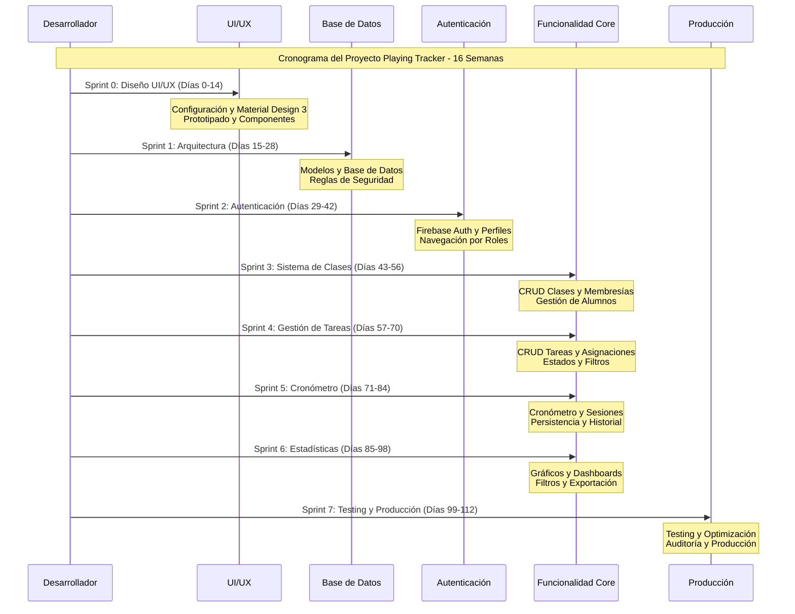
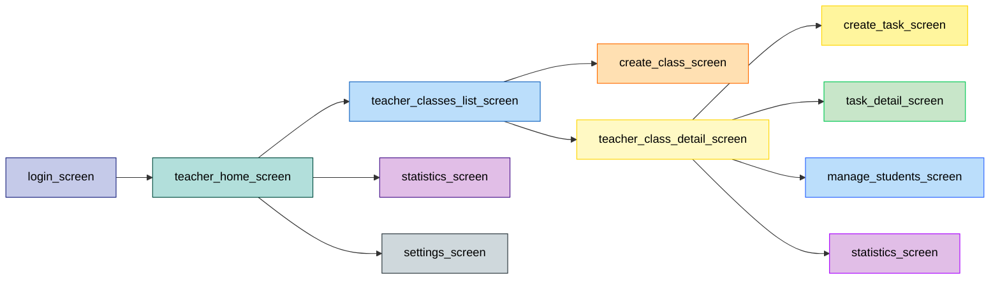
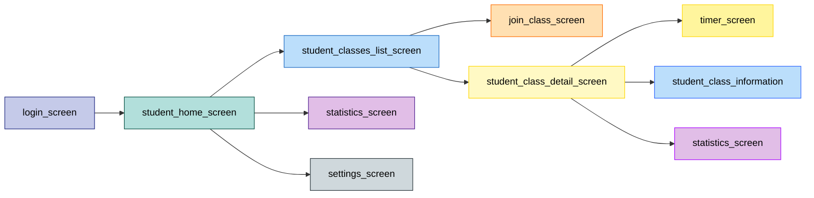

# 📋 Análisis de Requisitos y Fase de Diseño - Playing Tracker

**Proyecto:** Playing Tracker - Sistema de Seguimiento de Estudio Musical
**Fecha:** Octubre 2025
**Versión:** 1.0

---


## 1. Documento de análisis de requisitos

### 1.1	Descripción del proyecto
Playing Tracker es una aplicación móvil multiplataforma desarrollada en Flutter que digitaliza y objetiva el seguimiento del estudio instrumental fuera del aula. Permite a los docentes asignar tareas específicas y a los alumnos registrar el tiempo dedicado a cada una de ellas, generando estadísticas de progreso.

### 1.2	Requisitos funcionales
El sistema Playing Tracker debe proporcionar un conjunto completo de funcionalidades que permitan a los docentes gestionar sus clases y tareas, mientras que los alumnos puedan registrar y seguir su progreso de estudio de manera objetiva y motivadora.
1.	Gestión de usuarios y autenticación (RF-001). El sistema usa Firebase Authentication para registrar usuarios como docentes o alumnos. Los docentes gestionan clases, mientras que los alumnos se unen con códigos únicos. Incluye recuperación de contraseñas y gestión de perfiles, garantizando seguridad y privacidad.
2.	Gestión de clases y membresías (RF-002). Los docentes crean clases con nombres descriptivos y códigos de acceso únicos de 6 caracteres alfanuméricos, generados automáticamente. Los alumnos se unen con el código, permitiendo a los docentes gestionar su grupo de estudiantes.
3.	Gestión de tareas y asignaciones (RF-003). Los docentes crean tareas detalladas con título, descripción, tiempo sugerido de estudio (minutos) y archivos adjuntos opcionales (PDFs, audio, enlaces). Pueden asignar tareas a clases o alumnos específicos. El sistema crea automáticamente asignaciones individuales para clases completas.
4.	Cronómetro y registro de sesiones (RF-004). Los alumnos usan un cronómetro persistente para registrar sesiones de estudio (iniciar, pausar, reiniciar, finalizar). El sistema registra automáticamente duración, pausas y notas opcionales. Funciona en segundo plano, incluso al cambiar de app o recibir llamadas.
5.	Estadísticas y reportes (RF-005). El sistema genera estadísticas y visualizaciones del progreso de estudio para docentes y alumnos. Los docentes acceden a dashboards con filtros por fecha, tarea o clase. Los alumnos ven su progreso personal con gráficos.

#### Nota de avance · Sprint 3 (21/11/2025)
- RF-002 quedó respaldado por `AccessCodeGenerator`, `ClassService` y `MembershipService`, asegurando generación única de códigos y transacciones idempotentes para membresías (`lib/features/classes/data/services/`).
- Se documentaron los hooks de fan-out requeridos en Sprint 4: `ClassService.fanOutTaskHook` y `MembershipService.getStudentsForClass` funcionan como base para `FanOutHelper`.
- `firebase/firestore.rules` ahora permite que estudiantes creen/reactiven membresías solo cuando ellos mismos son los solicitantes, manteniendo la trazabilidad para docentes.
- Nuevos índices (`classes.ownerTeacherId+createdAt`, `memberships.classId+isActive+joinedAt`) garantizan paginación y fan-out eficiente para RF-004/RF-005.

### 1.3	Requisitos no funcionales
Los requisitos no funcionales establecen las características de calidad, rendimiento y restricciones técnicas que el sistema debe cumplir para garantizar una experiencia de usuario óptima y un funcionamiento seguro en entornos educativos reales.
1.	Rendimiento y eficiencia (RNF-001). El sistema garantiza tiempos de respuesta inferiores a 2 segundos para todas las operaciones CRUD, soportando 1000 usuarios concurrentes sin degradación. Implementa índices compuestos en Firestore, cache inteligente y paginación para listas extensas. El cronómetro mantiene precisión de milisegundos y actualiza la interfaz cada segundo sin afectar el rendimiento.
2.	Seguridad y privacidad (RNF-002). Dado que maneja datos de menores, la seguridad es crítica. Todas las operaciones requieren autenticación con reglas de seguridad granulares. Los datos se cifran en tránsito (HTTPS/TLS) y en reposo (Firestore). Cumple con RGPD y LOPDGDD, incluyendo consentimiento explícito, derecho al olvido y portabilidad de datos. Contraseñas almacenadas con hash seguro y autenticación de dos factores opcional.
3.	Usabilidad y accesibilidad (RNF-003). La interfaz de usuario, basada en Material Design 3, ofrece una experiencia moderna e intuitiva para usuarios jóvenes y adultos. Soporta temas claro y oscuro con transiciones suaves. La accesibilidad es prioritaria: contraste mínimo de 4.5:1 para textos normales y 3:1 para grandes, soporte para TalkBack (Android) y VoiceOver (iOS), y áreas de toque de 48x48 dp. La navegación es fluida con animaciones de 300ms y feedback táctil.
4.	Escalabilidad y mantenibilidad (RNF-004). La arquitectura NoSQL evita hotspots con distribución inteligente de datos y claves compuestas. Un mecanismo de fan-out eficiente asigna tareas a clases de hasta 100 alumnos sin degradación del rendimiento. La escalabilidad horizontal en Firebase permite el crecimiento orgánico, y la arquitectura modular facilita el mantenimiento y la adición de funcionalidades sin afectar el código existente.

### 1.4	Planificación del proyecto
El proyecto Playing Tracker se desarrollará con Scrum adaptado y “diseño primero”, priorizando la experiencia de usuario. Tendrá 8 sprints de 2 semanas, 16 semanas en total, con un desarrollador full-stack especializado en Flutter y Firebase.

#### 1.4.1	Metodología y enfoque
La metodología combina Scrum con un enfoque centrado en el diseño. Las dos primeras semanas se dedican a crear prototipos de alta fidelidad e implementar Material Design 3. Así, se toman todas las decisiones de UX/UI antes de la implementación de la lógica de negocio, reduciendo el rework y mejorando la calidad.

#### 1.4.2	Cronograma detallado
El Sprint 0 configurará el proyecto, implementará Material Design 3, prototipará todas las pantallas y desarrollará componentes base reutilizables. El Sprint 1 abordará la arquitectura de datos con 7 colecciones de Firestore, modelos de dominio, reglas de seguridad e índices optimizados. Los Sprints 2-4 cubrirán la funcionalidad core: autenticación, sistema de clases y membresías, y gestión de tareas. Los Sprints 5-6 implementarán funcionalidades avanzadas: cronómetro persistente y sistema de estadísticas. El Sprint 7 se dedicará a testing, optimización de rendimiento, auditoría de seguridad y preparación para producción.

#### 1.4.3	Estimación de costes
El coste total del proyecto se estima en 32,000€, calculado sobre la base de 16 semanas de desarrollo a 40 horas semanales con una tarifa de 50€/hora para un desarrollador senior especializado en Flutter. Esta estimación incluye el desarrollo completo de la aplicación, pero excluye costes de infraestructura (Firebase ofrece un tier gratuito generoso) y herramientas de desarrollo (Flutter, Android Studio, VS Code son gratuitas). El presupuesto es competitivo para una aplicación de esta complejidad y alcance, especialmente considerando la calidad y escalabilidad de la solución propuesta.

#### 1.4.4	Metodología de seguimiento
Los sprints tienen entregables específicos y medibles, revisados semanalmente para asegurar el cumplimiento de objetivos. El diagrama de la Ilustración 1 muestra las dependencias entre tareas para una gestión eficiente de recursos y detección temprana de retrasos. Las actividades permiten testing continuo y feedback iterativo para garantizar la calidad del producto.

### 1.5 Cronograma de Desarrollo (Diagrama de Gantt)

El siguiente diagrama de Gantt muestra la planificación detallada del proyecto Playing Tracker, organizando las actividades por sprints con sus respectivos entregables y dependencias:

Ilustración 1. Diagrama de Gantt - Cronograma de desarrollo

La imagen se encuentra guardada en /docs/images/Diagrama Gantt.png



---

## 2	Necesidades hardware, software y de personal necesarias para la aplicación. Presupuesto

### 2.1	Infraestructura hardware
•	Equipamiento de desarrollo: se utilizará un MacBook Pro M2 con 16 GB de RAM y 512 GB de SSD para el desarrollo de Flutter.
•	Dispositivos de prueba: se utilizarán un iPhone 15 Pro (para iOS) y un Realme 6s (para Android) para pruebas multiplataforma.

### 2.2	Software necesario
#### 2.2.1	Software de desarrollo gratuito
Playing Tracker usa herramientas de código abierto y gratuitas. Flutter SDK 3.x es el framework principal para desarrollo multiplataforma nativo. Android Studio es el IDE principal para Android, y VS Code con extensiones Flutter ofrece un entorno ligero y personalizable. Firebase CLI gestiona los servicios de Firebase, Git el control de versiones, y Dart SDK es el lenguaje de programación. Esta selección minimiza costes de licencias y ofrece herramientas de clase empresarial.

#### 2.2.2	Software de pago opcional
Para un diseño y desarrollo eficientes, puede utilizarse Figma Pro (20€/mes) para prototipos de alta fidelidad y colaboración. Firebase Blaze Plan, con un modelo pay-as-you-go, es ideal para producción y se adapta al crecimiento del usuario. Estos costes son opcionales en desarrollo, pero recomendados para un producto profesional.

### 2.3	Personal necesario
#### 2.3.1	Perfil del desarrollador
Se cuenta con un desarrollador full-stack junior con experiencia en Flutter, desarrollo móvil e integración con Firebase. Responsable del desarrollo completo de la app, incluyendo UI/UX (Material Design 3), integración Firebase (Auth, Firestore, Storage) y testing en múltiples dispositivos. Tiene conocimientos en arquitectura móvil, gestión de estado con Cubit y optimización de rendimiento.

### 2.4	Recursos de interconexión y hosting
#### 2.4.1	Infraestructura en la nube
Firebase ofrece la infraestructura backend completa para Playing Tracker, con servicios gratuitos generosos para las necesidades iniciales. Firebase Authentication es gratuito, Firestore ofrece 1GB gratis, Firebase Storage incluye 1GB gratis y Firebase Hosting es gratuito. Esta arquitectura serverless elimina la gestión de servidores y escala automáticamente.

#### 2.4.2	Estimación de costes operativos
Los costes anuales de infraestructura oscilan entre 0 y 100€, según el crecimiento de usuarios, más 15€ por el dominio de la aplicación. Firebase, con su modelo de pago por uso, se adapta al crecimiento orgánico del proyecto, permitiendo empezar con costes mínimos y escalar según la demanda.

### 2.5	Alternativas técnicas consideradas
#### 2.5.1	Análisis de alternativas
En la fase de planificación, se han evaluado varias alternativas tecnológicas. React Native + Node.js tenía un ecosistema maduro, pero menor rendimiento y mayor complejidad. Flutter + Supabase era una solución open source atractiva, pero menos madura y con mayor configuración inicial. Flutter + AWS ofrecía máxima escalabilidad, pero mayor complejidad y costes operativos.

#### 2.5.2	Justificación de la elección
La combinación Flutter + Firebase se ha seleccionado por ofrecer el mejor balance entre velocidad de desarrollo, coste controlado, y escalabilidad para un MVP. Material Design 3 garantiza consistencia visual y accesibilidad nativa, mientras que la arquitectura NoSQL de Firestore proporciona la flexibilidad necesaria para evolucionar el esquema de datos según las necesidades del proyecto. Esta elección minimiza los riesgos técnicos y acelera el time-to-market.

### 2.6	Presupuesto detallado y financiación
#### 2.6.1	Desglose de costes
El presupuesto total del proyecto asciende a 36,340€, distribuido en hardware (4,000€ si no se posee), software (340€/año), y personal (32,000€). El coste de desarrollo representa el 88% del presupuesto, lo cual es típico para proyectos de software donde el valor principal reside en el conocimiento y la experiencia del desarrollador. Los costes de hardware y software son una inversión única o recurrente mínima comparada con el valor generado.

#### 2.6.2	Estrategia de financiación
El proyecto se autofinanciará inicialmente para mantener el control sobre el desarrollo y la propiedad intelectual. Para marketing y expansión se usará crowdfunding dirigido a la comunidad educativa musical y se buscarán subvenciones de programas de innovación educativa que valoren su potencial pedagógico. Esta estrategia diversificada minimiza riesgos y permite un crecimiento sostenible.

---

## 3	Diseño del diagrama de casos de uso

### 3.1	Actores del sistema
El sistema Playing Tracker interactúa con tres tipos de actores principales que representan los diferentes roles y entidades involucradas en el proceso educativo musical:
•	Docente. Representa al profesor de música que utiliza la aplicación para gestionar sus clases, crear tareas, asignar actividades a sus alumnos, y supervisar el progreso de estudio. El docente tiene permisos administrativos completos sobre las clases que crea y puede acceder a estadísticas detalladas de todos sus alumnos. Este actor es responsable de la configuración inicial del entorno educativo y la definición de los objetivos de aprendizaje.
•	Alumno. Representa al estudiante de música que utiliza la aplicación para acceder a sus tareas asignadas, registrar sesiones de estudio mediante el cronómetro, y consultar su progreso personal. El alumno tiene permisos limitados a sus propios datos y tareas asignadas, garantizando la privacidad y seguridad de la información. Este actor es el usuario final que se beneficia directamente de las funcionalidades de seguimiento y motivación.
•	Sistema. Representa la aplicación Playing Tracker y sus componentes internos que procesan automáticamente los datos, generan estadísticas, envían notificaciones, y mantienen la sincronización entre dispositivos. El sistema actúa como intermediario entre docentes y alumnos, facilitando la comunicación y el seguimiento del progreso educativo.

### 3.2	Diagrama de casos de uso

Ilustración 2. Diagrama de casos de uso

La imagen se encuentra guardada en /docs/images/Diagrama Casos de uso.png

```mermaid
flowchart LR
flowchart LR
    subgraph "Actores"
        D[👨‍🏫 Docente]
        A[👨‍🎓 Alumno]
    end

    subgraph "Sistema Playing Tracker"
        UC1[Autenticación]
        UC2[Crear clase]
        UC3[Ver clase]
        UC4[Crear tarea]
        UC5[Ver tareas]
        UC6[Estadísticas]
        UC7[Unirse a clase]
        UC8[Iniciar sesión]
        UC9[Finalizar sesión]
        UC10[Progreso]
    end

    %% Flujo Docente
    D --> UC1
    UC1 --> UC2
    UC2 --> UC3
    UC3 --> UC4
    UC4 --> UC5
    UC5 --> UC6

    %% Flujo Alumno
    A --> UC1
    UC1 --> UC7
    UC7 --> UC5
    UC5 --> UC8
    UC8 --> UC9
    UC9 --> UC10

    %% Estilos
    classDef actor fill:#e3f2fd,stroke:#1976d2,stroke-width:3px
    classDef docente fill:#fff3e0,stroke:#f57c00,stroke-width:2px
    classDef alumno fill:#e8f5e8,stroke:#388e3c,stroke-width:2px
    classDef comun fill:#f3e5f5,stroke:#7b1fa2,stroke-width:2px

    class D,A actor
    class UC2,UC3,UC4,UC5,UC6 docente
    class UC7,UC8,UC9,UC10 alumno
    class UC1 comun
```

### 3.3	Casos de uso principales

#### 3.3.1	UC-001. Autenticación de usuario

| Campo | Descripción |
|-------|-------------|
| **Descripción breve** | El usuario se autentica en el sistema Playing Tracker utilizando sus credenciales de email y contraseña, siendo redirigido automáticamente a la interfaz correspondiente según su rol (docente o alumno). |
| **Precondiciones** | El usuario debe estar registrado previamente en el sistema con un email válido y contraseña. La aplicación debe estar instalada y funcionando correctamente en el dispositivo del usuario. |
| **Pasos habituales** | 1. El usuario abre la aplicación Playing Tracker. 2. El sistema presenta la pantalla de login con campos para email y contraseña. 3. El usuario introduce sus credenciales y presiona el botón "Iniciar Sesión". 4. El sistema valida las credenciales contra Firebase Authentication. 5. Si las credenciales son correctas, el sistema consulta el rol del usuario en Firestore. 6. El sistema redirige al usuario a la pantalla home correspondiente (docente o alumno). 7. El sistema establece la sesión activa y carga los datos del usuario. |
| **Postcondiciones** | El usuario está autenticado en el sistema con su sesión activa. Se ha cargado su perfil completo con nombre, apellidos, email y rol. El usuario puede acceder a todas las funcionalidades permitidas según su rol. |
| **Excepciones** | Si las credenciales son incorrectas, el sistema muestra un mensaje de error específico. Si el usuario no existe, se ofrece la opción de registro. Si hay problemas de conectividad, se muestra un mensaje de error de red. Si el usuario está desactivado, se informa del estado de la cuenta. |

#### 3.3.2	UC-002. Crear clase (docente)

| Campo | Descripción |
|-------|-------------|
| **Descripción breve** | El docente crea una nueva clase virtual en el sistema, definiendo su nombre, descripción opcional, y obteniendo automáticamente un código de acceso único que podrá compartir con sus alumnos para que se unan a la clase. |
| **Precondiciones** | El docente debe estar autenticado en el sistema con rol de docente. Debe tener conexión a internet activa. No debe existir una clase con el mismo nombre creada por el mismo docente. |
| **Pasos habituales** | 1. El docente accede a la pantalla "Mis Clases" desde el menú principal. 2. Presiona el botón "Crear Nueva Clase". 3. El sistema presenta un formulario con campos para nombre de clase y descripción opcional. 4. El docente introduce el nombre de la clase (mínimo 3 caracteres) y una descripción opcional. 5. Presiona el botón "Crear Clase". 6. El sistema valida los datos introducidos. 7. El sistema genera automáticamente un código de acceso único de 6 caracteres alfanuméricos. 8. El sistema crea el documento de clase en Firestore con todos los datos. 9. El sistema muestra la nueva clase creada con su código de acceso. |
| **Postcondiciones** | Se ha creado una nueva clase en el sistema con un identificador único. La clase tiene un código de acceso único generado automáticamente. El docente puede ver la clase en su lista de clases. La clase está activa y lista para que los alumnos se unan. |
| **Excepciones** | Si el nombre de la clase ya existe para el mismo docente, se muestra un mensaje de error pidiendo un nombre diferente. Si hay problemas de conectividad, se informa del error y se sugiere reintentar. Si el formulario está incompleto, se resaltan los campos obligatorios. Si hay un error interno del sistema, se muestra un mensaje genérico de error. |

#### 3.3.3	UC-003. Unirse a clase (alumno)

| Campo | Descripción |
|-------|-------------|
| **Descripción breve** | El alumno se une a una clase existente introduciendo el código de acceso proporcionado por su docente, estableciendo así una relación de membresía que le permitirá acceder a las tareas y actividades de esa clase. |
| **Precondiciones** | El alumno debe estar autenticado en el sistema con rol de alumno. Debe tener un código de acceso válido proporcionado por un docente. La clase debe existir y estar activa en el sistema. El alumno no debe estar ya unido a esa clase. |
| **Pasos habituales** | 1. El alumno accede a la pantalla "Unirse a Clase" desde el menú principal. 2. El sistema presenta un campo de texto para introducir el código de acceso. 3. El alumno introduce el código de 6 caracteres proporcionado por su docente. 4. Presiona el botón "Unirse a Clase". 5. El sistema valida el formato del código (6 caracteres alfanuméricos). 6. El sistema busca la clase correspondiente al código en Firestore. 7. Si la clase existe y está activa, el sistema crea un documento de membresía. 8. El sistema actualiza la lista de clases del alumno. 9. El sistema muestra un mensaje de confirmación de unión exitosa. |
| **Postcondiciones** | El alumno se ha unido exitosamente a la clase. Se ha creado una relación de membresía en el sistema. El alumno puede ver la clase en su lista de clases. El alumno puede acceder a las tareas asignadas a esa clase. El docente puede ver al alumno en la lista de miembros de la clase. |
| **Excepciones** | Si el código introducido no existe, se muestra un mensaje de error indicando que el código es inválido. Si la clase está desactivada, se informa que la clase no está disponible. Si el alumno ya está unido a la clase, se muestra un mensaje informativo. Si hay problemas de conectividad, se sugiere verificar la conexión e intentar nuevamente. |

#### 3.3.4	UC-004. Crear tarea (docente)

| Campo | Descripción |
|-------|-------------|
| **Descripción breve** | El docente crea una nueva tarea de estudio definiendo todos sus detalles (título, descripción, tiempo sugerido, archivos adjuntos) y la asigna a una clase completa o a alumnos específicos, generando automáticamente las asignaciones individuales correspondientes. |
| **Precondiciones** | El docente debe estar autenticado con rol de docente. Debe tener al menos una clase creada o alumnos disponibles para asignar. Debe tener conexión a internet activa. Los datos de la tarea deben cumplir con las validaciones establecidas. |
| **Pasos habituales** | 1. El docente accede a la pantalla "Crear Tarea" desde el menú de gestión de tareas. 2. El sistema presenta un formulario completo con todos los campos necesarios. 3. El docente introduce el título de la tarea (mínimo 5 caracteres). 4. El docente escribe una descripción detallada de la tarea (mínimo 10 caracteres). 5. El docente especifica el tiempo sugerido de estudio en minutos (mínimo 5, máximo 480). 6. Opcionalmente, el docente adjunta archivos (PDF, audio) o enlaces externos. 7. El docente selecciona los destinatarios: clase completa o alumnos específicos. 8. Opcionalmente, el docente establece una fecha límite para la tarea. 9. El docente presiona el botón "Crear y Asignar Tarea". 10. El sistema valida todos los datos introducidos. 11. El sistema crea el documento de tarea en Firestore. 12. El sistema ejecuta el fan-out para crear las asignaciones individuales. 13. El sistema muestra confirmación de creación exitosa. |
| **Postcondiciones** | Se ha creado una nueva tarea en el sistema con identificador único. La tarea ha sido asignada a todos los destinatarios seleccionados. Cada alumno destinatario tiene una asignación individual creada. Los alumnos pueden ver la nueva tarea en su lista de tareas pendientes. El docente puede gestionar la tarea desde su panel de control. |
| **Excepciones** | Si algún campo obligatorio está vacío, se resaltan los campos faltantes. Si el tiempo sugerido está fuera del rango permitido, se muestra un mensaje de error específico. Si hay problemas durante el fan-out, se informa del error y se sugiere reintentar. Si los archivos adjuntos exceden el tamaño permitido, se informa del límite. Si no hay destinatarios disponibles, se sugiere crear una clase o agregar alumnos. |

#### 3.3.5	UC-005. Iniciar sesión de estudio (alumno)

| Campo | Descripción |
|-------|-------------|
| **Descripción breve** | El alumno inicia una sesión de estudio cronometrada para una tarea específica, activando el cronómetro persistente que registrará automáticamente el tiempo dedicado al estudio, incluso si la aplicación pasa a segundo plano. |
| **Precondiciones** | El alumno debe estar autenticado con rol de alumno. Debe tener al menos una tarea asignada con estado "pending" o "in_progress". No debe tener una sesión activa en curso. Debe tener conexión a internet para el registro inicial. |
| **Pasos habituales** | 1. El alumno accede a su lista de tareas desde el menú principal. 2. El alumno selecciona una tarea específica de la lista. 3. El sistema muestra los detalles de la tarea y el botón "Iniciar Estudio". 4. El alumno presiona el botón "Iniciar Estudio". 5. El sistema presenta la pantalla de cronómetro con controles de estudio. 6. El sistema registra el inicio de la sesión con timestamp preciso. 7. El sistema inicia el cronómetro y lo mantiene activo. 8. El sistema actualiza el estado de la asignación a "in_progress". 9. El alumno puede pausar, reanudar o finalizar la sesión en cualquier momento. |
| **Postcondiciones** | Se ha iniciado una sesión de estudio activa para la tarea seleccionada. El cronómetro está funcionando y registrando el tiempo transcurrido. El estado de la asignación se ha actualizado a "in_progress". El sistema está preparado para persistir la sesión en segundo plano. El alumno puede ver el tiempo transcurrido en tiempo real. |
| **Excepciones** | Si la tarea no está disponible, se muestra un mensaje explicativo. Si ya hay una sesión activa, se informa y se ofrece la opción de finalizarla primero. Si hay problemas de conectividad, se inicia la sesión en modo offline. Si la tarea ha expirado, se informa del estado y se sugiere contactar al docente. |

#### 3.3.6	UC-006. Finalizar sesión de estudio (alumno)

| Campo | Descripción |
|-------|-------------|
| **Descripción breve** | El alumno finaliza su sesión de estudio cronometrada, confirmando la finalización y permitiendo al sistema calcular la duración total, actualizar las estadísticas, y registrar la sesión completada en la base de datos. |
| **Precondiciones** | Debe existir una sesión de estudio activa iniciada previamente. El cronómetro debe estar funcionando y haber registrado al menos 1 minuto de tiempo. El alumno debe estar autenticado y tener conexión a internet para sincronizar los datos. |
| **Pasos habituales** | 1. El alumno está en la pantalla de cronómetro con una sesión activa. 2. El alumno presiona el botón "Finalizar Sesión". 3. El sistema presenta una pantalla de confirmación mostrando el tiempo total registrado. 4. El alumno puede agregar notas opcionales sobre la sesión de estudio. 5. El alumno confirma la finalización presionando "Confirmar". 6. El sistema calcula la duración total de la sesión (tiempo activo menos pausas). 7. El sistema crea el documento de sesión en Firestore con todos los datos. 8. El sistema actualiza las estadísticas del alumno (sesiones totales, tiempo total). 9. El sistema actualiza el progreso de la asignación correspondiente. 10. El sistema muestra un mensaje de confirmación y regresa a la lista de tareas. |
| **Postcondiciones** | La sesión de estudio ha sido registrada exitosamente en la base de datos. Las estadísticas del alumno se han actualizado con la nueva sesión. El progreso de la tarea se ha actualizado con el tiempo adicional registrado. El cronómetro se ha detenido y la sesión ya no está activa. El alumno puede ver la sesión en su historial personal. |
| **Excepciones** | Si el tiempo registrado es menor a 1 minuto, se sugiere continuar estudiando. Si hay problemas de conectividad, se guarda localmente y se sincroniza cuando se recupere la conexión. Si hay errores al guardar, se informa del problema y se sugiere reintentar. Si la sesión ya fue finalizada, se muestra un mensaje informativo. |

#### 3.3.7	UC-007. Consultar estadísticas de progreso (docente/alumno)

| Campo | Descripción |
|-------|-------------|
| **Descripción breve** | El usuario (docente o alumno) consulta estadísticas detalladas de progreso de estudio, aplicando filtros específicos según sus necesidades, y visualizando gráficos y métricas que le permiten evaluar el rendimiento y evolución del aprendizaje musical. |
| **Precondiciones** | El usuario debe estar autenticado en el sistema. Debe existir al menos una sesión de estudio registrada para generar estadísticas. Para docentes, debe tener al menos una clase con alumnos activos. Para alumnos, debe tener al menos una tarea asignada y una sesión completada. |
| **Pasos habituales** | 1. El usuario accede a la sección "Estadísticas" desde el menú principal. 2. El sistema presenta la pantalla de estadísticas con filtros disponibles. 3. El usuario selecciona el período de tiempo (última semana, mes, trimestre, año). 4. Para docentes: selecciona la clase específica o "todas las clases". 5. Para alumnos: selecciona la tarea específica o "todas las tareas". 6. El usuario aplica filtros adicionales (días de la semana, horas del día). 7. El sistema consulta los datos correspondientes en Firestore. 8. El sistema genera gráficos y métricas en tiempo real. 9. El usuario visualiza las estadísticas con gráficos interactivos. 10. El usuario puede exportar los datos en formato CSV o PDF. |
| **Postcondiciones** | Se han mostrado las estadísticas solicitadas con los filtros aplicados. Los gráficos son interactivos y permiten exploración detallada. Los datos están actualizados y reflejan el estado actual del progreso. El usuario puede exportar la información para análisis externo. Las métricas son precisas y basadas en datos reales de sesiones registradas. |
| **Excepciones** | Si no hay datos suficientes para el período seleccionado, se muestra un mensaje informativo y se sugieren otros períodos. Si hay problemas de conectividad, se muestran los datos en caché con indicador de actualización pendiente. Si los filtros no devuelven resultados, se sugiere ampliar el rango de búsqueda. Si hay errores en la generación de gráficos, se muestran los datos en formato tabular. |

---

## 4. 🎨 Diseño de la Interfaz de la Aplicación

El diseño de la interfaz de Playing Tracker sigue los principios de Material Design 3, proporcionando una experiencia de usuario moderna, intuitiva y accesible. La aplicación implementa navegación condicional según el rol del usuario (docente o alumno), con flujos específicos optimizados para cada tipo de usuario.

### 4.1 Flujo de Navegación Docente

El flujo específico para docentes incluye gestión de clases, creación de tareas y visualización de estadísticas. La navegación utiliza un `BottomNavigationBar` con tres tabs principales:



### 4.2 Flujo de Navegación Alumno

El flujo específico para alumnos se centra en acceder a sus clases, visualizar tareas asignadas y registrar sesiones de estudio mediante el cronómetro:



### 4.3 Descripción de Pantallas

A continuación se describen las pantallas de la aplicación según su secuencia de aparición, mostrando primero la imagen correspondiente y luego una descripción breve con los flujos de navegación posibles.

#### Pantallas de Autenticación

##### Pantalla de Login


**Descripción:** Primera pantalla que ve el usuario al abrir la aplicación si no está autenticado. Implementa un formulario de inicio de sesión con diseño Material Design 3, incluyendo campos de email y contraseña con validación en tiempo real.

**Flujos de navegación:**
- Login exitoso → Redirección según rol (docente o alumno)
- Click en "Regístrate" → Pantalla de registro
- Click en "¿Olvidaste tu contraseña?" → Pantalla de recuperación

---

##### Pantalla de Registro


**Descripción:** Permite a nuevos usuarios crear una cuenta en el sistema, seleccionando su rol (docente o alumno) durante el proceso de registro. Incluye formulario completo con validaciones en tiempo real.

**Flujos de navegación:**
- Registro exitoso → Autenticación automática → Redirección según rol
- Click en "Inicia sesión" → Pantalla de login

---

##### Pantalla de Recuperación de Contraseña


**Descripción:** Permite a los usuarios recuperar su contraseña mediante el envío de un email de restablecimiento a través de Firebase Authentication.

**Flujos de navegación:**
- Envío exitoso → Mensaje de confirmación → Opción de volver al login
- Click en "Volver al login" → Pantalla de login

---

#### Pantallas de Docente

##### Pantalla Home Docente


**Descripción:** Pantalla de entrada para docentes autenticados. Actúa como punto de redirección hacia la lista de clases, mostrando un indicador de carga durante la transición.

**Flujos de navegación:**
- Carga completa → Redirección automática a Lista de Clases

---

##### Pantalla de Lista de Clases (Docente)


**Descripción:** Pantalla principal del docente que muestra todas las clases creadas por el usuario. Incluye navegación mediante BottomNavigationBar con tres tabs: Clases, Estadísticas y Configuración.

**Flujos de navegación:**
- Click en clase → Detalle de Clase Docente
- Click en FAB "Crear clase" → Pantalla de Crear Clase
- Tab Estadísticas → Pantalla de Estadísticas (contexto docente)
- Tab Configuración → Pantalla de Configuración

---

##### Pantalla de Crear Clase


**Descripción:** Formulario completo para que el docente cree una nueva clase, definiendo su nombre, descripción opcional y obteniendo automáticamente un código de acceso único de 6 caracteres.

**Flujos de navegación:**
- Creación exitosa → Detalle de Clase Docente con la nueva clase
- Click en "Cancelar" → Lista de Clases Docente

---

##### Pantalla de Detalle de Clase (Docente)


**Descripción:** Muestra información detallada de una clase específica con navegación mediante tabs para acceder a diferentes secciones: Tareas, Estudiantes y Estadísticas de la clase.

**Flujos de navegación:**
- Tab Tareas → Click en tarea → Detalle de Tarea
- Tab Tareas → FAB "Crear tarea" → Pantalla de Crear Tarea
- Tab Estudiantes → Botón "Gestionar" → Pantalla de Gestionar Alumnos
- Botón retroceso → Lista de Clases Docente

---

##### Pantalla de Gestionar Alumnos


**Descripción:** Permite al docente gestionar los alumnos miembros de una clase específica, incluyendo visualización de información, eliminación de membresías y acceso a estadísticas individuales.

**Flujos de navegación:**
- Click en alumno → Estadísticas del alumno
- Eliminación exitosa → Actualización de lista
- Botón retroceso → Detalle de Clase Docente

---

##### Pantalla de Crear Tarea


**Descripción:** Formulario completo para que el docente cree una nueva tarea de estudio, definiendo todos sus detalles (título, descripción, tiempo sugerido, archivos adjuntos) y asignándola a clases o alumnos específicos.

**Flujos de navegación:**
- Creación exitosa → Detalle de Tarea o Detalle de Clase Docente
- Click en "Cancelar" → Pantalla anterior

---

##### Pantalla de Detalle de Tarea (Docente)


**Descripción:** Muestra información completa de una tarea específica, incluyendo detalles, alumnos asignados y su progreso individual con indicadores visuales.

**Flujos de navegación:**
- Click en alumno → Estadísticas del alumno para esta tarea
- Botón "Editar" → Formulario de edición (si aplica)
- Botón retroceso → Pantalla anterior

---

##### Pantalla de Estadísticas (Docente)


**Descripción:** Dashboard completo de estadísticas que permite al docente visualizar el progreso de sus alumnos con múltiples filtros (período, clase, tarea) y visualizaciones gráficas interactivas.

**Flujos de navegación:**
- Click en alumno de la tabla → Estadísticas del alumno
- Click en tarea → Detalle de Tarea
- Botón "Exportar" → Diálogo de selección de formato (CSV o PDF)

---

##### Pantalla de Configuración (Docente)


**Descripción:** Permite al docente gestionar su perfil, preferencias de la aplicación (tema claro/oscuro, notificaciones) y configuraciones generales.

**Flujos de navegación:**
- Cerrar sesión → Pantalla de Login (limpieza de estado)
- Eliminar cuenta → Confirmación → Pantalla de Login

---

#### Pantallas de Alumno

##### Pantalla Home Alumno


**Descripción:** Pantalla de entrada para alumnos autenticados. Actúa como punto de redirección hacia la lista de clases del alumno, mostrando un indicador de carga durante la transición.

**Flujos de navegación:**
- Carga completa → Redirección automática a Lista de Clases Alumno

---

##### Pantalla de Lista de Clases (Alumno)


**Descripción:** Pantalla principal del alumno que muestra todas las clases a las que pertenece. Incluye navegación mediante BottomNavigationBar con tres tabs: Clases, Estadísticas y Configuración.

**Flujos de navegación:**
- Click en clase → Detalle de Clase Alumno
- Click en FAB "Unirse a clase" → Pantalla de Unirse a Clase
- Tab Estadísticas → Pantalla de Estadísticas (contexto alumno)
- Tab Configuración → Pantalla de Configuración

---

##### Pantalla de Unirse a Clase


**Descripción:** Permite al alumno unirse a una clase existente introduciendo el código de acceso único de 6 caracteres proporcionado por el docente.

**Flujos de navegación:**
- Unión exitosa → Detalle de Clase Alumno con la nueva clase
- Click en "Cancelar" → Lista de Clases Alumno

---

##### Pantalla de Detalle de Clase (Alumno)


**Descripción:** Muestra información detallada de una clase específica a la que pertenece el alumno, con navegación mediante tabs para acceder a diferentes secciones: Tareas, Información y Estadísticas.

**Flujos de navegación:**
- Tab Tareas → Click en tarea → Detalle de Tarea
- Tab Información → Pantalla de Información de Clase
- Tab Estadísticas → Estadísticas de la clase
- Botón retroceso → Lista de Clases Alumno

---

##### Pantalla de Información de Clase (Alumno)


**Descripción:** Muestra la información detallada de la clase y del docente, incluyendo descripción de la clase, datos de contacto del docente, código de acceso (solo lectura) y fecha de unión a la clase.

**Flujos de navegación:**
- Botón retroceso → Detalle de Clase Alumno
- Navegación mediante tabs → Tab Tareas o Tab Estadísticas

---

##### Pantalla de Detalle de Tarea (Alumno)


**Descripción:** Muestra información completa de una tarea asignada al alumno, incluyendo detalles, archivos adjuntos, progreso personal y opción para iniciar una sesión de estudio.

**Flujos de navegación:**
- Click en "Iniciar estudio" → Pantalla de Cronómetro con la tarea activa
- Click en "Ver historial" → Historial de Sesiones filtrado por tarea
- Botón retroceso → Pantalla anterior

---

##### Pantalla de Cronómetro


**Descripción:** Pantalla central del flujo de estudio del alumno. Implementa un cronómetro persistente que registra el tiempo de estudio incluso cuando la aplicación pasa a segundo plano, con controles para iniciar, pausar, reiniciar y finalizar la sesión.

**Flujos de navegación:**
- Click en "Finalizar sesión" → Diálogo de confirmación → Registro → Detalle de Tarea o Detalle de Clase Alumno
- Click en cerrar (AppBar) → Diálogo de confirmación si hay sesión activa

---

##### Pantalla de Estadísticas (Alumno)


**Descripción:** Dashboard de estadísticas personales que permite al alumno visualizar su progreso de estudio con gráficos y métricas motivadoras, incluyendo filtros por período, clase y tarea.

**Flujos de navegación:**
- Click en tarea → Detalle de Tarea
- Click en clase → Detalle de Clase Alumno

---

##### Pantalla de Configuración (Alumno)


**Descripción:** Permite al alumno gestionar su perfil, preferencias de la aplicación (tema claro/oscuro, notificaciones, recordatorios) y configuraciones generales.

**Flujos de navegación:**
- Cerrar sesión → Pantalla de Login (limpieza de estado)
- Eliminar cuenta → Confirmación → Pantalla de Login

---

## 5	Diseño de la base de datos

### 5.1	Modelo de datos conceptual

#### 5.1.1	Tipo de base de datos NoSQL utilizada
Playing Tracker utiliza **Cloud Firestore**, una base de datos NoSQL de tipo **document-store** (almacén de documentos) proporcionada por Firebase. Este tipo de base de datos organiza los datos en colecciones de documentos, donde cada documento es un conjunto de pares clave-valor que pueden contener tipos de datos primitivos, arrays, objetos anidados y referencias a otros documentos.

**Justificación de la elección:**
•	**Escalabilidad automática**: Firestore escala horizontalmente de forma automática sin requerir configuración manual de sharding o particionamiento.
•	**Tiempo real**: Soporte nativo para sincronización de datos en tiempo real mediante listeners, ideal para actualizar estadísticas y cronómetros sin recargar la aplicación.
•	**Integración nativa con Firebase**: Perfecta integración con Firebase Authentication, Storage y Cloud Functions, simplificando la arquitectura del sistema.
•	**Modelo flexible**: El esquema flexible permite evolucionar la estructura de datos sin migraciones complejas, adaptándose a cambios en los requisitos.
•	**Consultas eficientes**: Soporte para índices compuestos y consultas complejas con filtros múltiples, ordenamiento y paginación.
•	**Seguridad granular**: Sistema de reglas de seguridad declarativas que permiten controlar el acceso a nivel de documento y campo.

#### 5.1.2	Arquitectura de colecciones (7 colecciones top-level)
La arquitectura adoptada utiliza **colecciones desanidadas de primer nivel** que modelan relaciones N:M mediante documentos intermedios. Esta estrategia está optimizada para **rendimiento en lectura** y **escalabilidad anti-hotspot**, evitando los problemas de contención que pueden surgir con documentos muy solicitados.

| Colección | Propósito | Justificación Técnica |
|-----------|-----------|----------------------|
| `teachers` | Perfiles de docentes | Colección top-level con UID de Firebase Auth como ID para acceso directo O(1) |
| `students` | Perfiles de alumnos con agregados | Incluye contadores denormalizados (totalSessionsCount, totalDurationLogged) para consultas rápidas sin agregación en tiempo real |
| `classes` | Definiciones de clases/grupos | IDs globales únicos permiten consultas eficientes sin necesidad de conocer el propietario |
| `memberships` | Relación Alumno ↔ Clase (N:M) | Evita arrays grandes en documentos de clases que podrían causar hotspots de escritura con alta concurrencia |
| `tasks` | Definición maestra de tareas | Top-level permite reutilización de tareas entre múltiples clases sin duplicación |
| `assignments` | Progreso individual tarea-alumno | Estado 1:1 con clave compuesta `${taskId}_${studentId}` garantiza idempotencia y acceso directo |
| `sessions` | Registros atómicos de estudio | Top-level permite collection group queries para estadísticas agregadas eficientes |

#### 5.1.3	Descripción de entidades principales

##### Colección: `teachers` (Docentes)
Almacena los perfiles de los profesores de música que gestionan clases y tareas en la aplicación.

| Campo | Tipo de Dato | Obligatorio | Descripción |
|-------|--------------|-------------|-------------|
| `id` | string | ✅ Sí | UID de Firebase Authentication. Clave primaria que permite acceso directo O(1) |
| `firstName` | string | ✅ Sí | Nombre del docente (mínimo 3 caracteres, solo letras y espacios) |
| `lastName` | string | ✅ Sí | Apellidos del docente (mínimo 3 caracteres, solo letras y espacios) |
| `email` | string | ✅ Sí | Correo electrónico único del docente. Gestionado por Firebase Auth |
| `createdAt` | timestamp | ✅ Sí | Fecha y hora de creación del perfil (ISO 8601) |
| `updatedAt` | timestamp | ✅ Sí | Fecha y hora de última actualización del perfil (ISO 8601) |
| `isActive` | boolean | ✅ Sí | Estado de la cuenta (true = activa, false = desactivada). Default: true |

##### Colección: `students` (Alumnos)
Almacena los perfiles de los estudiantes con contadores denormalizados para optimizar consultas de estadísticas.

| Campo | Tipo de Dato | Obligatorio | Descripción |
|-------|--------------|-------------|-------------|
| `id` | string | ✅ Sí | UID de Firebase Authentication. Clave primaria |
| `firstName` | string | ✅ Sí | Nombre del alumno (mínimo 3 caracteres, solo letras y espacios) |
| `lastName` | string | ✅ Sí | Apellidos del alumno (mínimo 3 caracteres, solo letras y espacios) |
| `email` | string | ✅ Sí | Correo electrónico único del alumno. Gestionado por Firebase Auth |
| `createdAt` | timestamp | ✅ Sí | Fecha y hora de creación del perfil (ISO 8601) |
| `updatedAt` | timestamp | ✅ Sí | Fecha y hora de última actualización del perfil (ISO 8601) |
| `isActive` | boolean | ✅ Sí | Estado de la cuenta. Default: true |
| `totalSessionsCount` | number | ✅ Sí | Total de sesiones de estudio completadas. Default: 0. Actualizado mediante transacciones |
| `totalDurationLogged` | number | ✅ Sí | Segundos totales de estudio registrados. Default: 0. Actualizado mediante transacciones |
| `lastSessionDate` | timestamp | ❌ No | Fecha de la última sesión de estudio completada. Null si no hay sesiones |

##### Colección: `classes` (Clases)
Representa las clases o grupos virtuales creados por los docentes.

| Campo | Tipo de Dato | Obligatorio | Descripción |
|-------|--------------|-------------|-------------|
| `id` | string | ✅ Sí | Identificador único global generado por Firestore |
| `name` | string | ✅ Sí | Nombre descriptivo de la clase (mínimo 3 caracteres, máximo 50) |
| `description` | string | ❌ No | Descripción opcional de la clase (máximo 500 caracteres) |
| `ownerTeacherId` | string | ✅ Sí | ID del docente propietario (referencia a `teachers/{teacherId}`) |
| `accessCode` | string | ✅ Sí | Código de acceso único de 6 caracteres alfanuméricos (mayúsculas y números) para unirse a la clase |
| `createdAt` | timestamp | ✅ Sí | Fecha y hora de creación de la clase (ISO 8601) |
| `updatedAt` | timestamp | ✅ Sí | Fecha y hora de última actualización (ISO 8601) |
| `isActive` | boolean | ✅ Sí | Estado de la clase (true = activa, false = archivada). Default: true |

##### Colección: `memberships` (Membresías)
Modela la relación N:M entre alumnos y clases, evitando arrays grandes en documentos.

| Campo | Tipo de Dato | Obligatorio | Descripción |
|-------|--------------|-------------|-------------|
| `id` | string | ✅ Sí | Identificador único de la membresía generado por Firestore |
| `classId` | string | ✅ Sí | ID de la clase (referencia a `classes/{classId}`) |
| `studentId` | string | ✅ Sí | ID del alumno (referencia a `students/{studentId}`) |
| `teacherId` | string | ✅ Sí | ID del docente propietario (denormalizado para consultas eficientes) |
| `className` | string | ✅ Sí | Nombre de la clase (denormalizado para mostrar sin JOIN) |
| `joinedAt` | timestamp | ✅ Sí | Fecha y hora en que el alumno se unió a la clase (ISO 8601) |
| `isActive` | boolean | ✅ Sí | Estado de la membresía (true = activa, false = abandonada). Default: true |

##### Colección: `tasks` (Tareas)
Define las tareas de estudio creadas por los docentes. Almacenamiento centralizado que evita duplicación.

| Campo | Tipo de Dato | Obligatorio | Descripción |
|-------|--------------|-------------|-------------|
| `id` | string | ✅ Sí | Identificador único global generado por Firestore |
| `title` | string | ✅ Sí | Título de la tarea (mínimo 5 caracteres, máximo 100) |
| `description` | string | ✅ Sí | Descripción detallada de la tarea (mínimo 10 caracteres, máximo 2000) |
| `createdBy` | string | ✅ Sí | ID del docente creador (referencia a `teachers/{teacherId}`) |
| `durationSuggested` | number | ✅ Sí | Tiempo sugerido de estudio en minutos (rango: 5-480) |
| `attachments` | array | ❌ No | Array de objetos con archivos adjuntos: `{name: string, url: string, type: string}`. Tipos: "pdf", "audio", "link" |
| `createdAt` | timestamp | ✅ Sí | Fecha y hora de creación de la tarea (ISO 8601) |
| `updatedAt` | timestamp | ✅ Sí | Fecha y hora de última actualización (ISO 8601) |
| `dueDate` | timestamp | ❌ No | Fecha límite opcional para completar la tarea (ISO 8601) |
| `isActive` | boolean | ✅ Sí | Estado de la tarea (true = activa, false = eliminada). Default: true |

##### Colección: `assignments` (Asignaciones)
Representa el progreso individual de cada alumno en cada tarea asignada. Relación 1:1 entre tarea y alumno.

| Campo | Tipo de Dato | Obligatorio | Descripción |
|-------|--------------|-------------|-------------|
| `id` | string | ✅ Sí | Clave compuesta: `${taskId}_${studentId}`. Garantiza idempotencia y acceso directo |
| `taskId` | string | ✅ Sí | ID de la tarea (referencia a `tasks/{taskId}`) |
| `studentId` | string | ✅ Sí | ID del alumno (referencia a `students/{studentId}`) |
| `teacherId` | string | ✅ Sí | ID del docente (denormalizado para consultas eficientes) |
| `status` | string | ✅ Sí | Estado de la asignación: "pending" (pendiente), "in_progress" (en progreso), "completed" (completada) |
| `assignedAt` | timestamp | ✅ Sí | Fecha y hora de asignación de la tarea (ISO 8601) |
| `completedAt` | timestamp | ❌ No | Fecha y hora de finalización de la tarea (ISO 8601). Null si no está completada |
| `sessionsCount` | number | ✅ Sí | Número de sesiones de estudio realizadas para esta tarea. Default: 0 |
| `totalDurationLogged` | number | ✅ Sí | Segundos totales registrados para esta tarea. Default: 0 |
| `lastSessionDate` | timestamp | ❌ No | Fecha de la última sesión registrada. Null si no hay sesiones |

##### Colección: `sessions` (Sesiones)
Registros atómicos e inmutables de cada sesión de estudio realizada por un alumno.

| Campo | Tipo de Dato | Obligatorio | Descripción |
|-------|--------------|-------------|-------------|
| `id` | string | ✅ Sí | Identificador único de la sesión generado por Firestore |
| `studentId` | string | ✅ Sí | ID del alumno (referencia a `students/{studentId}`) |
| `taskId` | string | ✅ Sí | ID de la tarea estudiada (referencia a `tasks/{taskId}`) |
| `teacherId` | string | ✅ Sí | ID del docente propietario (denormalizado para consultas de estadísticas) |
| `startTime` | timestamp | ✅ Sí | Fecha y hora exacta de inicio de la sesión (ISO 8601) |
| `endTime` | timestamp | ✅ Sí | Fecha y hora exacta de finalización de la sesión (ISO 8601) |
| `totalDuration` | number | ✅ Sí | Duración total de la sesión en segundos (tiempo activo) |
| `pausedDuration` | number | ✅ Sí | Tiempo total en pausa en segundos. Default: 0 |
| `dateLogged` | timestamp | ✅ Sí | Fecha de la sesión para consultas por fecha (ISO 8601) |
| `monthBucket` | string | ✅ Sí | Mes de la sesión en formato "YYYY-MM" para consultas agregadas eficientes |
| `notes` | string | ❌ No | Notas opcionales del alumno sobre la sesión (máximo 500 caracteres) |
| `createdAt` | timestamp | ✅ Sí | Fecha y hora de creación del registro (ISO 8601) |

### 5.2	Ejemplos de documentos/datos

#### Ejemplo 1: Documento de docente (teachers)
```json
{
  "id": "7Kx9mPqR2aW4vNcT5eH8",
  "firstName": "María",
  "lastName": "García López",
  "email": "maria.garcia@conservatorio.com",
  "createdAt": "2025-10-15T10:30:00.000Z",
  "updatedAt": "2025-10-15T10:30:00.000Z",
  "isActive": true
}
```

**Descripción del ejemplo:**
Este documento representa el perfil de una docente de música llamada María García López registrada en el sistema. El campo `id` coincide con su UID de Firebase Authentication, permitiendo acceso directo y seguro a sus datos. El campo `isActive` con valor `true` indica que su cuenta está activa y puede utilizar todas las funcionalidades de la aplicación.

#### Ejemplo 2: Documento de alumno con agregados (students)
```json
{
  "id": "3Hn8pLm4qW7aVxC2kR9j",
  "firstName": "Carlos",
  "lastName": "Rodríguez Martín",
  "email": "carlos.rodriguez@estudiante.com",
  "createdAt": "2025-10-15T11:00:00.000Z",
  "updatedAt": "2025-10-20T15:30:00.000Z",
  "isActive": true,
  "totalSessionsCount": 15,
  "totalDurationLogged": 27000,
  "lastSessionDate": "2025-10-20T15:30:00.000Z"
}
```

**Descripción del ejemplo:**
Este documento muestra el perfil de un alumno activo con historial de estudio. Los campos denormalizados `totalSessionsCount` (15 sesiones), `totalDurationLogged` (27,000 segundos = 7.5 horas) y `lastSessionDate` permiten mostrar estadísticas rápidas sin necesidad de consultar la colección `sessions`. Estos contadores se actualizan mediante transacciones cada vez que el alumno completa una sesión de estudio.

#### Ejemplo 3: Documento de sesión completa (sessions)
```json
{
  "id": "5Qw9mNx2pR7kH4vT8cL3",
  "studentId": "3Hn8pLm4qW7aVxC2kR9j",
  "taskId": "9Lp4mKx7nW2qV5cR8jH1",
  "teacherId": "7Kx9mPqR2aW4vNcT5eH8",
  "startTime": "2025-10-20T14:00:00.000Z",
  "endTime": "2025-10-20T15:30:00.000Z",
  "totalDuration": 5400,
  "pausedDuration": 300,
  "dateLogged": "2025-10-20T00:00:00.000Z",
  "monthBucket": "2025-10",
  "notes": "Estudio de escalas mayores con metrónomo a 80 bpm",
  "createdAt": "2025-10-20T15:30:00.000Z"
}
```

**Descripción del ejemplo:**
Este documento registra una sesión de estudio completada por el alumno Carlos. La sesión comenzó a las 14:00 y finalizó a las 15:30, con una duración total de 5,400 segundos (90 minutos) y 300 segundos (5 minutos) en pausa. El campo `monthBucket` con valor "2025-10" permite consultas eficientes de estadísticas mensuales sin necesidad de procesar rangos de fechas complejos. Las `notes` opcionales permiten al alumno documentar aspectos específicos de su práctica.

### 5.3	Scripts de creación/configuración y datos iniciales

#### 5.3.1	Reglas de seguridad de Firestore
Las reglas de seguridad de Firestore controlan el acceso a los datos a nivel de documento y colección. Este script debe configurarse en la consola de Firebase (Firestore → Rules) o desplegarse mediante Firebase CLI.

```javascript
rules_version = '2';
service cloud.firestore {
  match /databases/{database}/documents {

    // Función auxiliar: verifica si el usuario está autenticado
    function isAuth() {
      return request.auth != null;
    }

    // Función auxiliar: verifica si el usuario es el propietario del documento
    function isOwner(userId) {
      return isAuth() && request.auth.uid == userId;
    }

    // Colección: teachers
    // Solo el docente propietario puede leer y escribir su propio perfil
    match /teachers/{teacherId} {
      allow read, write: if isOwner(teacherId);
    }

    // Colección: students
    // Solo el alumno propietario puede leer y escribir su propio perfil
    match /students/{studentId} {
      allow read, write: if isOwner(studentId);
    }

    // Colección: classes
    // Lectura: cualquier usuario autenticado
    // Escritura: solo el docente propietario
    match /classes/{classId} {
      allow read: if isAuth();
      allow write: if isAuth() && resource.data.ownerTeacherId == request.auth.uid;
    }

    // Colección: memberships
    // Lectura: alumno o docente involucrado
    // Escritura: solo el docente propietario
    match /memberships/{membershipId} {
      allow read: if isAuth() && (
        resource.data.studentId == request.auth.uid ||
        resource.data.teacherId == request.auth.uid
      );
      allow write: if isAuth() && request.resource.data.teacherId == request.auth.uid;
    }

    // Colección: tasks
    // Lectura: cualquier usuario autenticado
    // Escritura: solo el docente creador
    match /tasks/{taskId} {
      allow read: if isAuth();
      allow write: if isAuth() && resource.data.createdBy == request.auth.uid;
    }

    // Colección: assignments
    // Lectura: alumno asignado o docente propietario
    // Escritura: docente propietario o alumno para actualizar progreso
    match /assignments/{assignmentId} {
      allow read: if isAuth() && (
        resource.data.studentId == request.auth.uid ||
        resource.data.teacherId == request.auth.uid
      );
      allow write: if isAuth() && (
        resource.data.teacherId == request.auth.uid ||
        request.resource.data.studentId == request.auth.uid
      );
    }

    // Colección: sessions
    // Creación: solo el alumno propietario
    // Lectura: alumno propietario o docente asociado
    // Actualización/Eliminación: no permitida (inmutabilidad)
    match /sessions/{sessionId} {
      allow create: if isAuth() && request.resource.data.studentId == request.auth.uid;
      allow read: if isAuth() && (
        resource.data.studentId == request.auth.uid ||
        resource.data.teacherId == request.auth.uid
      );
      allow update, delete: if false;
    }
  }
}
```

**Descripción del script:**
Este conjunto de reglas implementa un modelo de seguridad granular que garantiza que cada usuario solo pueda acceder y modificar los datos para los que tiene permisos. Las reglas incluyen funciones auxiliares (`isAuth`, `isOwner`) que mejoran la legibilidad y mantenibilidad del código. La inmutabilidad de la colección `sessions` (no se permite `update` ni `delete`) garantiza la integridad de los datos históricos de estudio.

#### 5.3.2	Índices compuestos recomendados
Firestore requiere índices compuestos para consultas con múltiples filtros y ordenamiento. Este script debe ejecutarse mediante Firebase CLI o configurarse en la consola de Firebase (Firestore → Indexes).

```json
{
  "indexes": [
    {
      "collectionGroup": "memberships",
      "queryScope": "COLLECTION",
      "fields": [
        { "fieldPath": "studentId", "order": "ASCENDING" },
        { "fieldPath": "isActive", "order": "ASCENDING" },
        { "fieldPath": "joinedAt", "order": "DESCENDING" }
      ]
    },
    {
      "collectionGroup": "memberships",
      "queryScope": "COLLECTION",
      "fields": [
        { "fieldPath": "teacherId", "order": "ASCENDING" },
        { "fieldPath": "classId", "order": "ASCENDING" },
        { "fieldPath": "isActive", "order": "ASCENDING" }
      ]
    },
    {
      "collectionGroup": "assignments",
      "queryScope": "COLLECTION",
      "fields": [
        { "fieldPath": "studentId", "order": "ASCENDING" },
        { "fieldPath": "status", "order": "ASCENDING" },
        { "fieldPath": "assignedAt", "order": "DESCENDING" }
      ]
    },
    {
      "collectionGroup": "assignments",
      "queryScope": "COLLECTION",
      "fields": [
        { "fieldPath": "teacherId", "order": "ASCENDING" },
        { "fieldPath": "taskId", "order": "ASCENDING" },
        { "fieldPath": "status", "order": "ASCENDING" }
      ]
    },
    {
      "collectionGroup": "sessions",
      "queryScope": "COLLECTION",
      "fields": [
        { "fieldPath": "studentId", "order": "ASCENDING" },
        { "fieldPath": "dateLogged", "order": "DESCENDING" }
      ]
    },
    {
      "collectionGroup": "sessions",
      "queryScope": "COLLECTION",
      "fields": [
        { "fieldPath": "teacherId", "order": "ASCENDING" },
        { "fieldPath": "monthBucket", "order": "ASCENDING" },
        { "fieldPath": "dateLogged", "order": "DESCENDING" }
      ]
    }
  ]
}
```

**Descripción de los índices:**
Estos índices compuestos optimizan las consultas más frecuentes del sistema: listar clases de un alumno, obtener tareas asignadas por estado, consultar sesiones de estudio por fecha, y generar estadísticas mensuales. Sin estos índices, Firestore rechazaría estas consultas compuestas.

#### 5.3.3	Archivo de datos iniciales de prueba
Este archivo JSON contiene datos de prueba que pueden cargarse manualmente en Firestore o mediante un script de inicialización para facilitar el desarrollo y testing. Los datos representan un escenario real con un docente, dos alumnos, una clase y tareas asignadas.

```json
{
  "teachers": [
    {
      "id": "teacher_001_test",
      "firstName": "Ana",
      "lastName": "Martínez Sánchez",
      "email": "ana.martinez@conservatorio.com",
      "createdAt": "2025-10-01T09:00:00.000Z",
      "updatedAt": "2025-10-01T09:00:00.000Z",
      "isActive": true
    }
  ],
  "students": [
    {
      "id": "student_001_test",
      "firstName": "Luis",
      "lastName": "González Pérez",
      "email": "luis.gonzalez@estudiante.com",
      "createdAt": "2025-10-01T10:00:00.000Z",
      "updatedAt": "2025-10-05T14:30:00.000Z",
      "isActive": true,
      "totalSessionsCount": 5,
      "totalDurationLogged": 9000,
      "lastSessionDate": "2025-10-05T14:30:00.000Z"
    },
    {
      "id": "student_002_test",
      "firstName": "Elena",
      "lastName": "Fernández Ruiz",
      "email": "elena.fernandez@estudiante.com",
      "createdAt": "2025-10-01T10:30:00.000Z",
      "updatedAt": "2025-10-01T10:30:00.000Z",
      "isActive": true,
      "totalSessionsCount": 0,
      "totalDurationLogged": 0,
      "lastSessionDate": null
    }
  ],
  "classes": [
    {
      "id": "class_001_test",
      "name": "Piano Nivel 1",
      "description": "Clase de piano para estudiantes principiantes. Fundamentos de técnica y lectura musical.",
      "ownerTeacherId": "teacher_001_test",
      "accessCode": "PIANO1",
      "createdAt": "2025-10-01T09:30:00.000Z",
      "updatedAt": "2025-10-01T09:30:00.000Z",
      "isActive": true
    }
  ],
  "memberships": [
    {
      "id": "membership_001_test",
      "classId": "class_001_test",
      "studentId": "student_001_test",
      "teacherId": "teacher_001_test",
      "className": "Piano Nivel 1",
      "joinedAt": "2025-10-01T11:00:00.000Z",
      "isActive": true
    },
    {
      "id": "membership_002_test",
      "classId": "class_001_test",
      "studentId": "student_002_test",
      "teacherId": "teacher_001_test",
      "className": "Piano Nivel 1",
      "joinedAt": "2025-10-01T11:15:00.000Z",
      "isActive": true
    }
  ],
  "tasks": [
    {
      "id": "task_001_test",
      "title": "Escalas mayores (Do, Sol, Re)",
      "description": "Practicar escalas mayores de Do, Sol y Re en dos octavas. Prestar atención a la digitación correcta y al sonido uniforme. Usar metrónomo comenzando a 60 bpm.",
      "createdBy": "teacher_001_test",
      "durationSuggested": 30,
      "attachments": [
        {
          "name": "Digitación de escalas",
          "url": "https://storage.googleapis.com/playing-tracker/attachments/escalas-digitacion.pdf",
          "type": "pdf"
        }
      ],
      "createdAt": "2025-10-02T10:00:00.000Z",
      "updatedAt": "2025-10-02T10:00:00.000Z",
      "dueDate": "2025-10-15T23:59:59.000Z",
      "isActive": true
    },
    {
      "id": "task_002_test",
      "title": "Ejercicios de Hanon (Nº 1-5)",
      "description": "Estudiar los primeros cinco ejercicios de Hanon para desarrollar independencia y fortaleza de los dedos. Practicar lentamente primero y aumentar gradualmente la velocidad.",
      "createdBy": "teacher_001_test",
      "durationSuggested": 45,
      "attachments": [],
      "createdAt": "2025-10-02T10:30:00.000Z",
      "updatedAt": "2025-10-02T10:30:00.000Z",
      "dueDate": null,
      "isActive": true
    }
  ],
  "assignments": [
    {
      "id": "task_001_test_student_001_test",
      "taskId": "task_001_test",
      "studentId": "student_001_test",
      "teacherId": "teacher_001_test",
      "status": "in_progress",
      "assignedAt": "2025-10-02T10:00:00.000Z",
      "completedAt": null,
      "sessionsCount": 3,
      "totalDurationLogged": 5400,
      "lastSessionDate": "2025-10-05T14:30:00.000Z"
    },
    {
      "id": "task_001_test_student_002_test",
      "taskId": "task_001_test",
      "studentId": "student_002_test",
      "teacherId": "teacher_001_test",
      "status": "pending",
      "assignedAt": "2025-10-02T10:00:00.000Z",
      "completedAt": null,
      "sessionsCount": 0,
      "totalDurationLogged": 0,
      "lastSessionDate": null
    },
    {
      "id": "task_002_test_student_001_test",
      "taskId": "task_002_test",
      "studentId": "student_001_test",
      "teacherId": "teacher_001_test",
      "status": "in_progress",
      "assignedAt": "2025-10-02T10:30:00.000Z",
      "completedAt": null,
      "sessionsCount": 2,
      "totalDurationLogged": 3600,
      "lastSessionDate": "2025-10-04T16:00:00.000Z"
    }
  ],
  "sessions": [
    {
      "id": "session_001_test",
      "studentId": "student_001_test",
      "taskId": "task_001_test",
      "teacherId": "teacher_001_test",
      "startTime": "2025-10-03T15:00:00.000Z",
      "endTime": "2025-10-03T16:00:00.000Z",
      "totalDuration": 3600,
      "pausedDuration": 0,
      "dateLogged": "2025-10-03T00:00:00.000Z",
      "monthBucket": "2025-10",
      "notes": "Primera sesión de práctica. Me cuesta la escala de Re.",
      "createdAt": "2025-10-03T16:00:00.000Z"
    },
    {
      "id": "session_002_test",
      "studentId": "student_001_test",
      "taskId": "task_002_test",
      "teacherId": "teacher_001_test",
      "startTime": "2025-10-04T15:00:00.000Z",
      "endTime": "2025-10-04T16:00:00.000Z",
      "totalDuration": 3600,
      "pausedDuration": 300,
      "dateLogged": "2025-10-04T00:00:00.000Z",
      "monthBucket": "2025-10",
      "notes": "Ejercicios 1-3 completados. Pausé 5 minutos para descansar.",
      "createdAt": "2025-10-04T16:00:00.000Z"
    },
    {
      "id": "session_003_test",
      "studentId": "student_001_test",
      "taskId": "task_001_test",
      "teacherId": "teacher_001_test",
      "startTime": "2025-10-05T14:00:00.000Z",
      "endTime": "2025-10-05T14:30:00.000Z",
      "totalDuration": 1800,
      "pausedDuration": 0,
      "dateLogged": "2025-10-05T00:00:00.000Z",
      "monthBucket": "2025-10",
      "notes": "Sesión corta de repaso. Mejora notable en la escala de Re.",
      "createdAt": "2025-10-05T14:30:00.000Z"
    }
  ]
}
```

**Descripción de los datos iniciales:**
Este conjunto de datos de prueba representa un escenario educativo completo y realista:
•	**1 docente** (Ana Martínez) que imparte Piano Nivel 1
•	**2 alumnos** (Luis González con historial de estudio, y Elena Fernández recién registrada sin sesiones)
•	**1 clase** (Piano Nivel 1) con código de acceso "PIANO1"
•	**2 membresías** activas (ambos alumnos unidos a la clase)
•	**2 tareas** asignadas (Escalas mayores y Ejercicios de Hanon) con diferentes características (una con archivo adjunto y fecha límite, otra sin ellos)
•	**3 asignaciones** que muestran diferentes estados (in_progress para Luis, pending para Elena)
•	**3 sesiones** de estudio completadas por Luis con diferentes duraciones, pausas y notas

Este conjunto de datos permite probar todas las funcionalidades principales de la aplicación: creación de clases, asignación de tareas, registro de sesiones, y visualización de estadísticas.

---

## 📊 Resumen del Diseño

Este documento establece las bases técnicas y funcionales para el desarrollo de **Playing Tracker**, una aplicación móvil innovadora para el seguimiento del estudio musical. La arquitectura propuesta, basada en Flutter + Firebase con gestión de estado mediante Cubit, garantiza escalabilidad, rendimiento y una excelente experiencia de usuario.

**Puntos clave del diseño:**
- ✅ Arquitectura NoSQL optimizada con 7 colecciones
- ✅ Gestión de estado con Cubit para simplicidad
- ✅ Material Design 3 para experiencia moderna
- ✅ Seguridad robusta con reglas granulares
- ✅ Escalabilidad anti-hotspot implementada
- ✅ Presupuesto controlado y desarrollo iterativo

El proyecto está listo para comenzar con el **Sprint 0** de implementación del diseño UI/UX.
